# BASIS — Building Automation Secure Identity Service

**A working reference implementation of identity-aware access control for operational technology environments.**

Cryptographically signed tokens. Named action authorization. Policy-based authorization evaluation. Durable audit trails. Applied to the building systems and data center infrastructure that have historically operated without any of it.

[](https://codespaces.new/basis-foundation/basis-poc)

---

## Contents

- [Why BASIS Exists](#why-basis-exists)
- [Platform Preview](#platform-preview)
- [What BASIS Is](#what-basis-is)
- [Quick Architecture](#quick-architecture)
- [Core Concepts](#core-concepts)
- [Why OT Identity Matters](#why-ot-identity-matters)
- [Security Philosophy](#security-philosophy)
- [Guided Demo](#guided-demo)
- [Architecture](#architecture)
- [Keycloak and IAM Integration](#keycloak-and-iam-integration)
- [Technical Architecture](#technical-architecture)
- [Local Development Setup](#local-development-setup)
- [GitHub Codespaces Setup](#github-codespaces-setup)
- [Architecture Documentation and ADRs](#architecture-documentation-and-adrs)
- [Current Limitations](#current-limitations)
- [Roadmap](#roadmap)

---

## Why BASIS Exists

Working across IAM, DevOps, cloud infrastructure, and platform engineering, I watched modern IT make a decisive shift — from perimeter-based trust to identity-aware architecture. Cryptographically signed credentials. Action-based authorization. Structured audit trails. These are now table stakes in cloud-native environments.

Operational technology hasn't made that transition.

Building automation systems, HVAC controllers, environmental sensors, and data center infrastructure — including the cooling and power systems that keep AI clusters running — still operate largely on flat, trusted networks. Credentials are often shared. Access control is coarse-grained or absent. Audit trails are an afterthought. A technician with dashboard access can frequently issue commands with no authentication, no authorization check, and no record.

BASIS is my exploration of what it looks like to apply modern identity infrastructure to OT environments: what the architecture needs to look like, what the tradeoffs are, and where the genuine hard problems are. It's a proof-of-concept built to be read, extended, and challenged — not deployed.

— Brandon Helmer

---

## Platform Preview

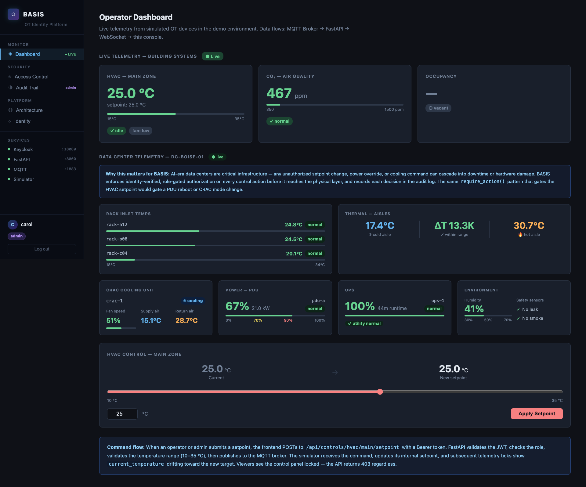

_Carol (admin) logged in. Live telemetry streams over an authenticated WebSocket. The Data Center section shows rack inlet temperatures, thermal aisle data, and CRAC cooling status from the simulator._

---

## What BASIS Is

BASIS is a control plane for OT environments. It sits in front of physical systems — HVAC controllers, sensors, MQTT brokers, Modbus devices — and enforces identity verification and authorization policy before any command reaches them.

**What it demonstrates:**

- Every API request carries a cryptographically signed JWT issued by Keycloak. The API validates the signature, expiry, and issuer before doing anything else.
- Commands are authorized against named actions (`write:hvac:setpoint`, `write:modbus:setpoint`, `read:audit:log`) evaluated by a `PolicyEngine`. Endpoints declare what they do; the policy table decides who may do it.
- Every authorization decision and command dispatch is written to a structured audit log — stdout and SQLite — with subject identity, action, resource, outcome, and timestamp.
- Protocol adapters (MQTT, Modbus TCP) share the same security boundary. Adding a new protocol requires a new adapter; the auth, policy, and audit layers are untouched.
- The telemetry gateway binds WebSocket sessions to JWT identity. Sessions expire when the token expires. The audit trail covers the full session lifecycle.

**What it is not:**

- A production system. MQTT runs without TLS, traffic is plain HTTP, Keycloak uses a development database. These are known, deliberate gaps.
- A real Modbus, BACnet, or OPC-UA implementation. The Modbus adapter manages an in-memory register bank.
- A replacement for Niagara, Ignition, or any industrial SCADA platform.
- Ready for deployment without a full security review.

---

## Quick Architecture

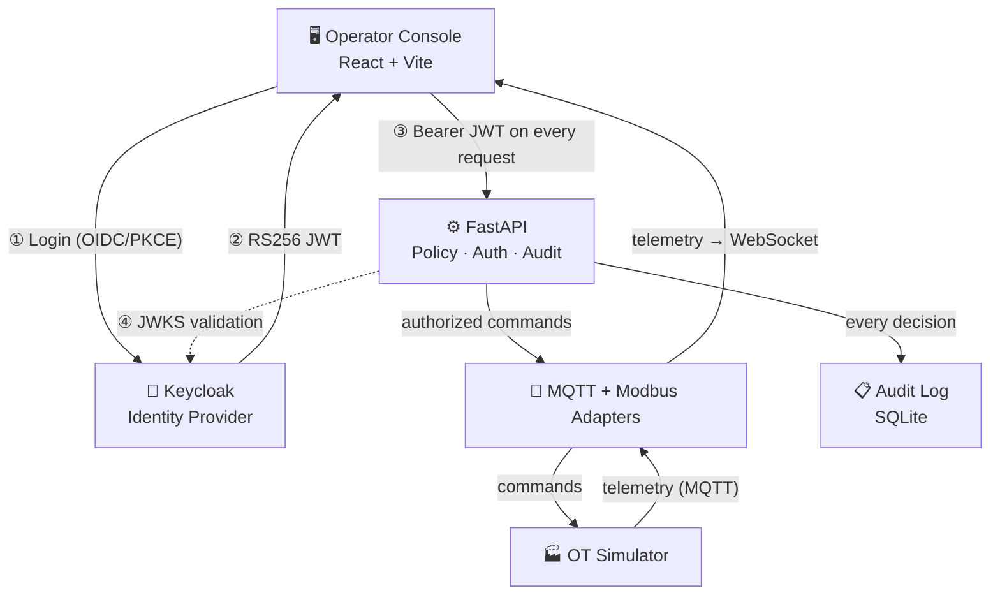

_The API is the sole trust boundary. No client writes directly to the MQTT broker or Modbus registers. Every command is JWT-validated and policy-evaluated before reaching the adapter layer._

---

## Core Concepts

BASIS introduces a small domain model used consistently across the codebase, API responses, and audit log entries:

| Concept          | What it represents                                                                             |
| ---------------- | ---------------------------------------------------------------------------------------------- |
| **Subject**      | Who is acting — parsed from the JWT. Typed: HUMAN, DEVICE, SERVICE, GATEWAY, AGENT.           |
| **Action**       | What is being attempted — named constants like `write:hvac:setpoint`, `read:audit:log`.        |
| **Resource**     | What is being acted on — HVAC controllers, sensors, Modbus devices, zones.                     |
| **PolicyEngine** | Evaluates each request: allow, deny, or pass to the next policy in the chain.                  |
| **AuditEvent**   | Immutable record of every authorization decision — allowed and denied — with subject, action, resource, outcome, and timestamp. |

These concepts appear verbatim in audit records and are stable across all protocol adapters.

---

## Why OT Identity Matters

The absence of identity controls in OT environments is not a theoretical risk. It produces concrete operational problems:

A technician with read-only dashboard access can frequently issue override commands — because access control is perimeter-based, not action-based. There is no authoritative record of who changed a setpoint and when. A compromised credential grants access to everything the MQTT broker will accept. Multiple protocols (Modbus, BACnet, MQTT) each have separate — or absent — access control mechanisms with no unified policy layer.

As AI infrastructure scales, this gap becomes more consequential. GPU clusters are dense, thermally critical systems — and the cooling and power infrastructure keeping them alive (CRAC units, PDUs, UPS systems) is OT. An unauthorized command to any of these, without identity verification or audit, can cascade into rack shutdowns or extended outages.

BASIS gates every such action through the same policy path: JWT validation → PolicyEngine evaluation → AuditEvent emission → adapter dispatch. The same infrastructure that manages an HVAC setpoint governs a CRAC cooling command or a PDU load action. One control plane. One audit trail. One policy table.

---

## Security Philosophy

The security model in BASIS reflects a specific set of design convictions.

**Identity from the authoritative source.** Role claims are read from the JWT's `realm_access.roles` field, which is set by Keycloak at token issuance and covered by the RS256 signature. The API does not accept role assertions from request bodies, headers, or query parameters. Identity is not asserted by clients; it is verified against a cryptographic proof.

**Action-based authorization, not role checks at endpoints.** Endpoints declare what action they perform. The policy table decides who may perform it. Adding a new role requires one change in `policy/rbac.py` — not a search across every router for hardcoded role checks. Action names are stable identifiers that appear verbatim in audit records; renaming them breaks audit trail continuity.

**Audit as a first-class concern.** Every authorization decision is recorded — not just the allowed ones. A 403 for alice attempting to issue a command is as important to the audit trail as bob's successful setpoint change. The audit log is the authoritative record of what happened, who did it, and what the system decided.

**Protocol-agnostic security boundary.** The `PolicyEngine` and audit logger are evaluated at the router layer, above the adapter layer. A Modbus adapter, MQTT adapter, and any future BACnet or OPC-UA adapter all cross the same security boundary. The adapter has no knowledge of authorization. This is enforced by the import graph: `adapters/` never imports from `policy/` or `auth/`.

**Defense in depth on commands.** Every command is validated at three independent layers: the frontend (prevents obvious user errors before the HTTP request), FastAPI (enforces authorization policy and payload constraints), and the simulator (drops malformed messages regardless of source). The physical data plane is the last line — not the first.

**Tokens in memory only.** `keycloak-js` stores JWTs in memory, not `localStorage` or `sessionStorage`. This prevents token theft via XSS. The tradeoff — tokens lost on page reload — is accepted in exchange for a meaningful security improvement.

---

## Guided Demo

The fastest way to explore BASIS is in a GitHub Codespace. No local Docker setup required.

[](https://codespaces.new/basis-foundation/basis-poc)

### Starting the Environment

1. Click the badge above and wait for the Codespace to initialize (3–5 minutes on first start).
2. All services build and start automatically — no commands to run.
3. Keycloak takes an additional 60–90 seconds to complete realm import.
4. When services are ready, open the **Ports** tab in VS Code (bottom panel → Ports). Locate the forwarded port for **5173** (labeled "Operator Console") and click the globe icon to open it in your browser.
5. Log in as any of the three demo users.

### Demo Credentials

Password for all users: `demo123`

| User    | Role     | What you can do                    |
| ------- | -------- | ---------------------------------- |
| `alice` | viewer   | Live telemetry dashboard only      |
| `bob`   | operator | Telemetry + HVAC setpoint commands |
| `carol` | admin    | Full access + audit log            |

### 5-Minute Walkthrough

**Step 1 — Live telemetry (log in as `bob`)**

Watch HVAC temperature, CO₂ air quality, and occupancy telemetry arrive via authenticated WebSocket. Scroll down on the Dashboard to see the **Data Center** section: rack inlet temperatures, hot/cold aisle thermals, CRAC cooling unit, PDU load, UPS battery state, and environmental sensors — all streaming live from the simulator.

**Step 2 — Issue a command**

Use the HVAC setpoint slider in the Control Panel to issue a temperature command. Observe the temperature drift in the telemetry card as the simulator responds. The API validated bob's JWT, evaluated `write:hvac:setpoint` via the PolicyEngine, confirmed his `operator` role, and published the MQTT command before the simulator ever received it.

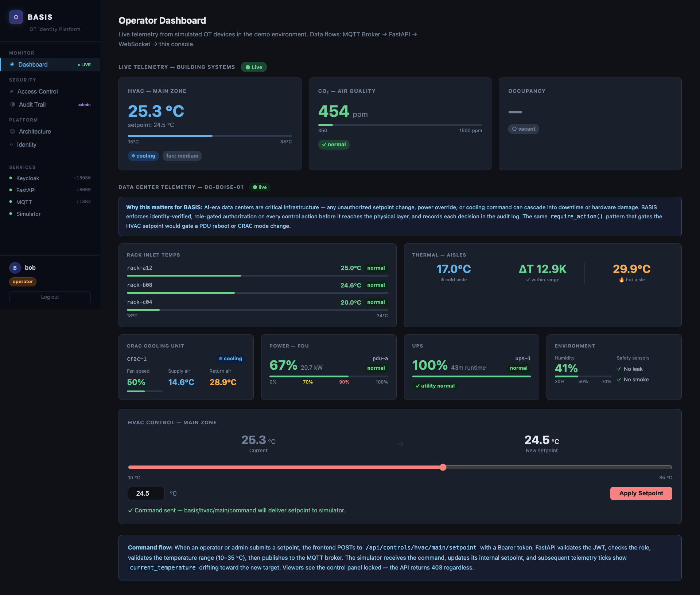

_Bob (operator) submitting a new HVAC setpoint. Every layer of the authorization path is visible in the API logs._

**Step 3 — Observe access enforcement (log in as `alice`)**

Log out. Log in as `alice` (viewer). The control panel is locked. A direct API call to any command endpoint with her token returns 403 — the policy boundary is enforced server-side regardless of what the UI renders.

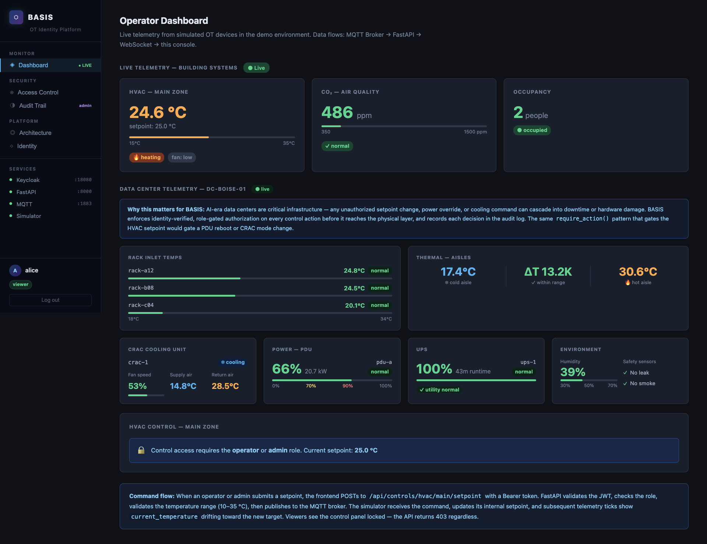

_Alice (viewer) encounters the authorization boundary. The frontend reflects the server-side policy — it doesn't replace it._

**Step 4 — Read the audit trail (log in as `carol`)**

Log out. Log in as `carol` (admin). Open the **Audit Trail** tab in the sidebar. Every action bob and alice took — including alice's 403 — appears as a timestamped event with subject, action, resource, and outcome. Filter by subject, outcome, or action to explore the audit data.

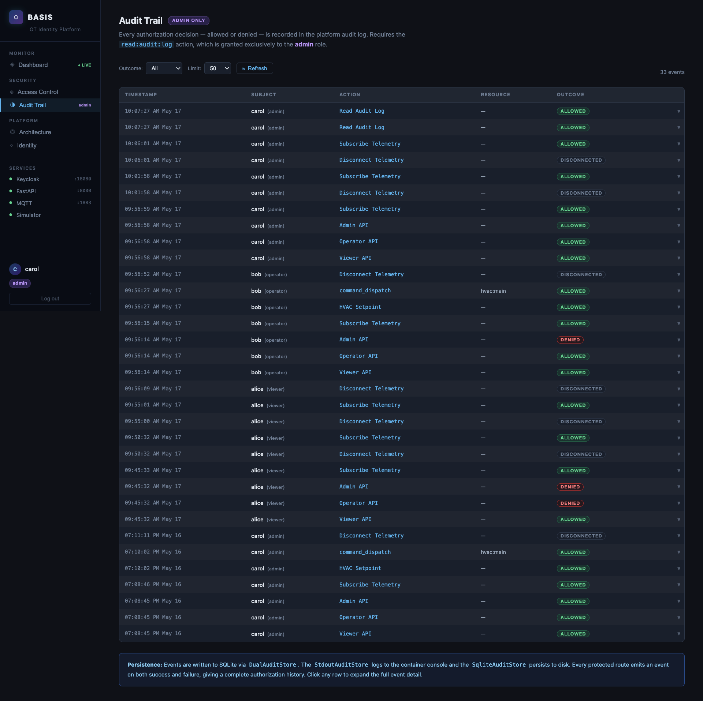

_The audit log is the authoritative record of every authorization decision. Denied events are as important as allowed ones._

> **Developer access:** The raw API is browsable at `http://localhost:8000/docs` (Swagger UI). Protected endpoints require a Bearer token — paste one from your browser's dev tools Network tab. The Operator Console handles token injection automatically and is the recommended exploration path.

---

## Architecture

### Component Overview

| Service               | Technology    | Role                                                                                                      |
| --------------------- | ------------- | --------------------------------------------------------------------------------------------------------- |
| **Identity Provider** | Keycloak 23   | OIDC/OAuth2 authority. Issues RS256-signed JWTs. Owns the role model.                                     |
| **API Gateway**       | FastAPI       | Validates JWTs, evaluates PolicyEngine, bridges adapters to WebSocket.                                    |
| **Message Broker**    | Mosquitto 2.0 | MQTT broker. Internal bus for telemetry and commands. Credentials required, anonymous access disabled.    |
| **OT Adapters**       | Python        | `MqttAdapter` and `ModbusTcpAdapter`. Both implement `AdapterBase` — same lifecycle, different protocols. |
| **OT Simulator**      | Python        | Simulates HVAC, sensors, and data center systems. Publishes MQTT telemetry, subscribes to commands.       |
| **Operator Console**  | React + Vite  | Browser SPA. OIDC login via PKCE, live telemetry dashboard, role-gated control panel, audit view.         |

All services run via Docker Compose. No cloud dependency. No Kubernetes.

### Architecture Diagram

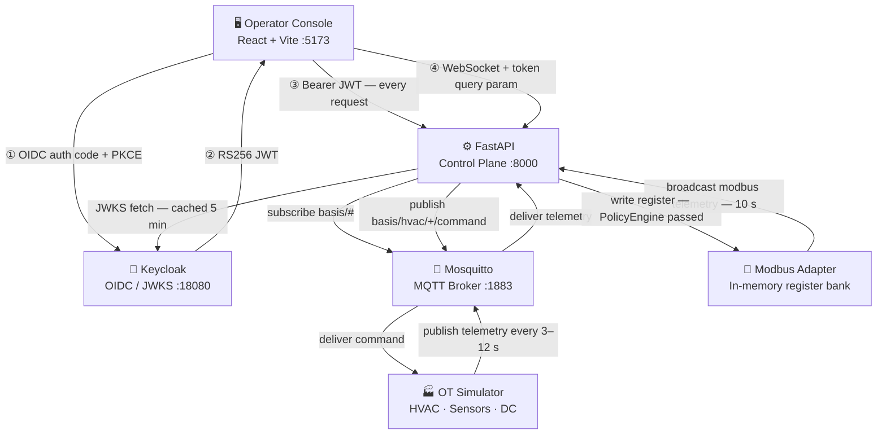

### Data Flow

Telemetry flows upward: **Simulator → Mosquitto → API → WebSocket → Browser.** The Modbus adapter emits telemetry directly to the WebSocket broadcaster on its own 10-second tick.

Commands flow downward: **Browser → API (PolicyEngine evaluated) → adapter → protocol → physical state change → reflected in next telemetry tick.**

The API is the sole trust boundary. No client publishes directly to the MQTT broker or writes to any register. Every command crosses the control plane.

---

## Keycloak and IAM Integration

### Realm Structure

Keycloak hosts a realm named `basis` with two OIDC clients:

| Client           | Type          | Purpose                                              |
| ---------------- | ------------- | ---------------------------------------------------- |
| `basis-frontend` | Public (PKCE) | Browser SPA — initiates OIDC authorization code flow |
| `basis-api`      | Bearer-only   | API reference — token validation only                |

### Role Model

Three realm roles are defined. They are additive — each level includes access granted at lower levels, as encoded in the `_ACTION_ROLES` table in `policy/rbac.py`.

| Role       | Persona                      | Permitted actions                           |
| ---------- | ---------------------------- | ------------------------------------------- |
| `viewer`   | Read-only dashboard consumer | Telemetry subscription, resource registry   |
| `operator` | Facilities technician        | Telemetry + HVAC setpoint + Modbus commands |
| `admin`    | Platform operator            | All of the above + audit log                |

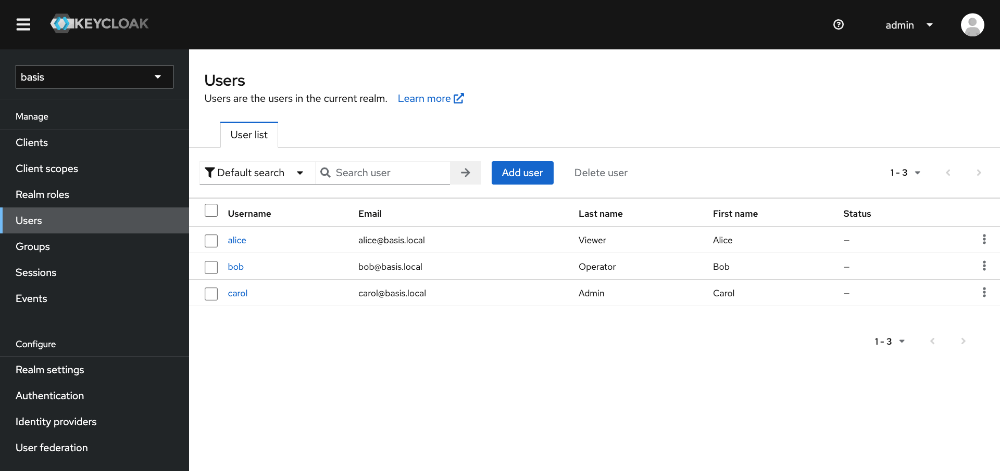

_The three demo users in the Keycloak admin console (`http://localhost:18080/admin`). Role assignments are the only configuration that determines what each user can do._

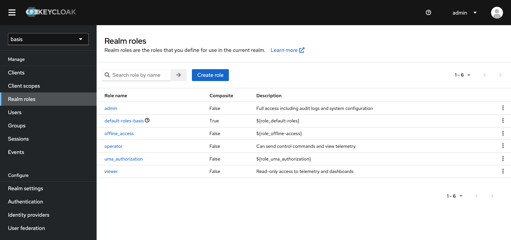

_Realm roles in Keycloak. Roles are assigned to users in Keycloak and surfaced in the JWT's `realm_access.roles` claim — the API never accepts role assertions from clients._

### JWT and Authorization

Keycloak issues RS256-signed JWTs. Roles are carried in the `realm_access` claim:

```json
{
  "iss": "http://localhost:18080/realms/basis",
  "sub": "a7b8c9d0-...",
  "preferred_username": "bob",
  "realm_access": {
    "roles": ["operator", "default-roles-basis", "offline_access"]
  },
  "exp": 1735000000
}
```

The API validates the signature, expiry, and issuer using Keycloak's published RSA public keys (JWKS endpoint). The API never holds a copy of any private key or client secret. Key rotation is handled transparently — the API re-fetches JWKS on an unknown `kid`.

Endpoints declare their required action; the policy table decides who may perform it:

```python
# Router layer — declares the action
subject: Subject = Depends(require_action(actions.WRITE_HVAC_SETPOINT))

# policy/rbac.py — maps actions to roles (one table, one place)
actions.WRITE_HVAC_SETPOINT:   {"operator", "admin"},
actions.SUBSCRIBE_TELEMETRY:   {"viewer", "operator", "admin"},
actions.READ_AUDIT_LOG:        {"admin"},
```

### Authentication Flow

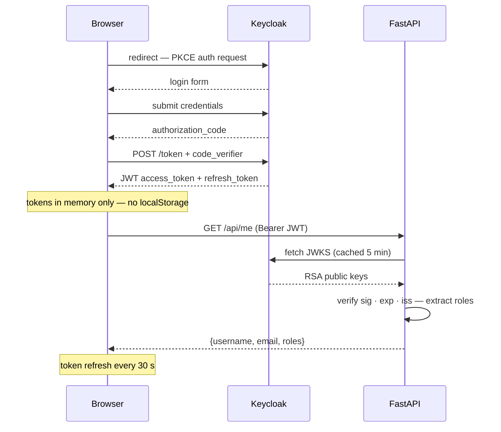

---

## Technical Architecture

### Authorization Model

The Core Concepts introduced earlier map directly to the codebase structure:

| Concept             | Implementation detail                                                                                              |
| ------------------- | ------------------------------------------------------------------------------------------------------------------ |
| **Subject**         | Parsed from the JWT at the auth boundary. `SubjectType` enum: HUMAN, DEVICE, SERVICE, GATEWAY, AGENT.             |
| **Action**          | String constants in `policy/actions.py` — e.g. `write:hvac:setpoint`. Stable; renaming breaks audit continuity.   |
| **Resource**        | Typed objects in a static registry (`domain/resource.py`). Validated before commands reach adapters.              |
| **PolicyEngine**    | Chain-of-responsibility evaluator in `policy/engine.py`. Each policy may allow, deny, or pass to the next.        |
| **RoleBasedPolicy** | The current implementation in `policy/rbac.py`. One `_ACTION_ROLES` table maps actions to permitted roles.        |
| **AuditEvent**      | Written to stdout and SQLite on every decision — authorization outcomes and command dispatches both.               |

### Telemetry Flow

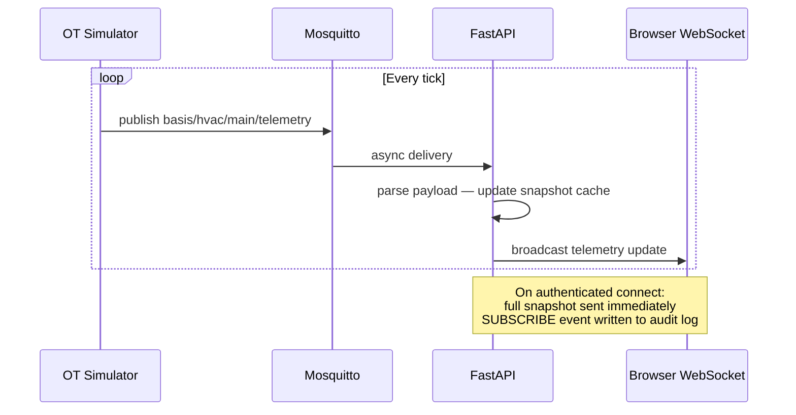

The API maintains an in-memory snapshot (topic → latest payload). A client connecting mid-session receives a full snapshot immediately, then incremental updates. Each WebSocket session is identity-bound — subject name, roles, and token expiry are recorded in a `TelemetrySession` at connect time.

### MQTT Topics

Topics follow the pattern `basis/{system}/{zone}/{message-type}`:

| Topic                                    | Publisher | Cadence | Key payload fields                                                       |
| ---------------------------------------- | --------- | ------- | ------------------------------------------------------------------------ |
| `basis/hvac/main/telemetry`              | Simulator | 3 s     | `current_temperature`, `target_temperature`, `hvac_mode`, `fan_speed`    |
| `basis/sensors/co2/telemetry`            | Simulator | 6 s     | `co2_level`, `unit`, `status`                                            |
| `basis/sensors/occupancy/telemetry`      | Simulator | 12 s    | `occupancy_status`, `occupant_count`                                     |
| `basis/datacenter/dc-boise-01/telemetry` | Simulator | 9 s     | `racks[]`, `thermal{}`, `cooling{}`, `power{}`, `ups{}`, `environment{}` |
| `basis/modbus/chiller-1/telemetry`       | Adapter   | 10 s    | `supply_temp_setpoint_c`, `supply_temp_actual_c`, `status`               |
| `basis/modbus/pump-1/telemetry`          | Adapter   | 10 s    | `speed_pct`, `flow_lpm`, `status`                                        |

### Data Center Telemetry

The simulator publishes a composite data center event on `basis/datacenter/dc-boise-01/telemetry` every ~9 seconds. Six subsystems in a single message:

| Field group   | Key signals                                                       |
| ------------- | ----------------------------------------------------------------- |
| `racks[]`     | Per-rack inlet temperature + status (normal / warning / critical) |
| `thermal`     | Cold aisle temp, hot aisle temp, ΔT                               |
| `cooling`     | CRAC unit mode, fan speed %, supply/return air temps              |
| `power`       | PDU load %, kW draw, status (normal / warning / overload)         |
| `ups`         | Battery %, runtime, utility power state, status                   |
| `environment` | Humidity %, leak detected, smoke detected                         |

### WebSocket Authentication

```
ws://localhost:8000/ws/telemetry?token=<access_token>
```

| Close code | Meaning                                                    |
| ---------- | ---------------------------------------------------------- |
| `4000`     | Authentication or authorization failure — do not reconnect |
| `4001`     | Token expired mid-session — refresh and reconnect          |

The frontend handles `4001` automatically: it calls `keycloak.updateToken()` then reconnects.

### Command Flow (HVAC)

**Endpoint:** `POST /api/controls/hvac/{zone}/setpoint`  
**Required action:** `write:hvac:setpoint` — operator, admin

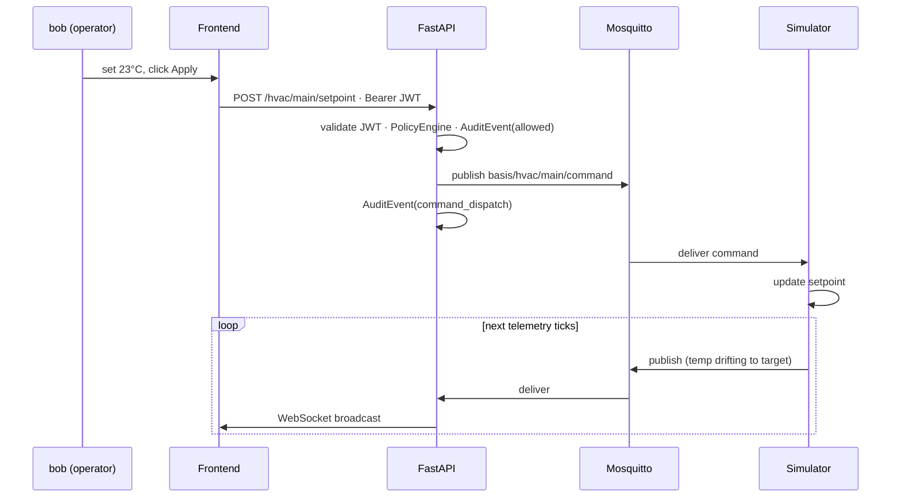

### Validation Layers

| Layer               | Location  | What it catches                            | Response                 |
| ------------------- | --------- | ------------------------------------------ | ------------------------ |
| Range check         | Frontend  | Out-of-range before HTTP request           | Input prevented          |
| JWT validation      | FastAPI   | Missing / invalid / expired token          | 401 Unauthorized         |
| PolicyEngine        | FastAPI   | Valid token, action not permitted for role | 403 Forbidden            |
| Pydantic model      | FastAPI   | Wrong type, out of range, missing field    | 422 Unprocessable Entity |
| Resource registry   | FastAPI   | Unknown zone or device identifier          | 404 Not Found            |
| Adapter unavailable | FastAPI   | Broker or register bank unreachable        | 503 Service Unavailable  |
| Payload validation  | Simulator | Malformed or replayed MQTT messages        | Logged and dropped       |

### Role Matrix

| User    | Role     | Telemetry | HVAC commands | Modbus commands | Audit log |
| ------- | -------- | :-------: | :-----------: | :-------------: | :-------: |
| `alice` | viewer   |    ✅     |    ❌ 403     |     ❌ 403      |  ❌ 403   |
| `bob`   | operator |    ✅     |      ✅       |       ✅        |  ❌ 403   |
| `carol` | admin    |    ✅     |      ✅       |       ✅        |    ✅     |

### MQTT Authentication

The broker runs with anonymous access disabled. Each service authenticates with a distinct identity:

| Service   | MQTT identity     | Purpose                                                    |
| --------- | ----------------- | ---------------------------------------------------------- |
| API       | `basis-api`       | Subscribe `basis/#`, publish `basis/hvac/+/command`        |
| Simulator | `basis-simulator` | Publish telemetry topics, subscribe `basis/hvac/+/command` |

Credentials are stored in `infra/mosquitto/passwd` as PBKDF2-SHA512 hashes.

### Security Decisions (Summary)

Full reasoning is in `docs/adr/` — see Architecture Decision Records below. Key choices:

- **PKCE** for the browser client — no client secret it can safely hold
- **JWKS-based validation** — the API never holds a private key or client secret
- **Separate internal/external Keycloak URLs** — prevents token forgery from within the Docker network
- **Action-based authorization** — policy changes don't touch routers; router changes don't touch policy
- **Audit on every decision** — denied events are as important as allowed ones

---

## Local Development Setup

### Prerequisites

- Docker Desktop 4.x or later (includes Compose v2)
- No local Python, Node, or Java required

### Quick Start

```bash
git clone <repo-url> basis-poc
cd basis-poc
cp .env.example .env
docker compose up --build
```

First build takes 3–5 minutes (image pulls + `npm install` + `pip install`). Subsequent starts are fast due to Docker layer caching.

### Startup Sequence

```
Keycloak          — imports basis realm from infra/keycloak/realm-export.json (60–90 s)
Mosquitto         — MQTT broker, health-checked before dependents start
  ↓
API               — depends: Mosquitto healthy
Simulator         — depends: Mosquitto healthy
  ↓
Frontend          — depends: API started
```

Keycloak starts in parallel. The API and frontend do not gate on Keycloak — auth begins working once Keycloak completes realm import.

### Service URLs

| Service            | URL                                 | Notes                                            |
| ------------------ | ----------------------------------- | ------------------------------------------------ |
| Operator Console   | http://localhost:5173               | Log in to begin                                  |
| API                | http://localhost:8000               |                                                  |
| API docs (Swagger) | http://localhost:8000/docs          | Paste a Bearer token to test protected endpoints |
| Keycloak admin     | http://localhost:18080/admin        | `admin` / `admin`                                |
| Keycloak realm     | http://localhost:18080/realms/basis | Realm metadata                                   |
| MQTT (TCP)         | localhost:1883                      | Credentials required — see `.env.example`        |
| MQTT (WebSocket)   | localhost:9001                      | Available for browser MQTT clients               |

### Useful Commands

```bash
# Rebuild a specific service after code changes
docker compose up --build api

# Restart a single service without rebuilding
docker compose restart simulator

# Tail logs for one service
docker compose logs -f api

# Watch the MQTT wire (credentials required)
mosquitto_sub -h localhost -p 1883 -u basis-api -P basis-api-secret -t 'basis/#' -v

# Query the audit log (admin token required)
curl -s -H "Authorization: Bearer <carol-token>" \
  "http://localhost:8000/api/audit?limit=20" | python3 -m json.tool

# Inspect audit events for a specific action
curl -s -H "Authorization: Bearer <carol-token>" \
  "http://localhost:8000/api/audit?action=write%3Ahvac%3Asetpoint"

# Full reset — wipes all volumes (Keycloak DB, audit DB, MQTT data)
docker compose down -v && docker compose up --build
```

### Hot Reload

Source is volume-mounted into each container. Python changes trigger `uvicorn --reload` automatically. React changes trigger Vite HMR. Simulator changes require `docker compose restart simulator`.

---

## GitHub Codespaces Setup

Codespaces provides a cloud-hosted environment where BASIS runs exactly as it does locally — same Docker Compose stack, same services, same architecture.

### What Configures Automatically

When the Codespace is first created, `.devcontainer/scripts/post-create.sh`:

1. Copies `.env.example` to `.env` and rewrites `localhost` URLs to Codespaces forwarded-port URLs.
2. Sets `KC_PROXY=edge` so Keycloak constructs its issuer URL correctly behind the Codespaces HTTPS proxy.
3. Runs `docker compose up --build -d` to build all images and start all services.
4. Waits for Keycloak to complete realm import (60–90 seconds).
5. Patches the `basis-frontend` OIDC client's redirect URIs via the Keycloak admin API, adding the Codespaces frontend URL.
6. Prints a welcome message with all service URLs and demo credentials.

When a Codespace is **resumed**, `.devcontainer/scripts/post-start.sh` repeats steps 3–5 (images are already built, so this takes ~60–90 seconds, dominated by Keycloak).

### Opening the Operator Console

After the environment initializes:

1. In VS Code, open the **Ports** tab (bottom panel → Ports, or View → Open View → Ports).
2. Locate the forwarded port for **5173** — it's labeled "Operator Console".
3. Click the globe icon next to that port to open the Operator Console in your browser.

### Service URLs in Codespaces

Forwarded-port URLs follow the pattern `https://{codespace-name}-{port}.app.github.dev`:

| Service          | Port  | URL pattern                                 |
| ---------------- | ----- | ------------------------------------------- |
| Operator Console | 5173  | `https://{name}-5173.app.github.dev`        |
| API (Swagger UI) | 8000  | `https://{name}-8000.app.github.dev/docs`   |
| Keycloak admin   | 18080 | `https://{name}-18080.app.github.dev/admin` |
| MQTT (TCP)       | 1883  | Not usable from browser — internal only     |
| MQTT (WebSocket) | 9001  | `wss://{name}-9001.app.github.dev`          |

The VS Code Ports panel shows live URLs for your specific Codespace.

### Why Keycloak Requires Runtime Patching

The realm is imported from `infra/keycloak/realm-export.json`, which registers `http://localhost:5173` as the valid redirect URI for `basis-frontend`. In Codespaces, the browser accesses the frontend via a `https://{name}-5173.app.github.dev` URL, which would fail Keycloak's redirect URI validation. The post-create script adds the Codespaces URL via the admin API — the `realm-export.json` is not modified, so local development is unaffected.

### Troubleshooting

**"Services are starting, please wait…" on first load**

Normal. The console retries connecting to Keycloak up to 8 times (5-second intervals) while services initialize. Wait for the attempt counter to reach success — no action needed.

**"Authentication Failed" after all retries**

Keycloak may have taken longer than expected. Check:

```bash
docker compose logs keycloak | tail -30
curl http://localhost:18080/realms/basis
```

If Keycloak is ready but auth still fails, re-run the post-start script to re-patch the redirect URIs:

```bash
bash .devcontainer/scripts/post-start.sh
```

**"redirect_uri mismatch" error on login**

The Codespaces frontend URL wasn't added to Keycloak's allowed redirect URIs. Re-run:

```bash
bash .devcontainer/scripts/post-start.sh
```

**Telemetry cards show "reconnecting" but don't receive data**

```bash
curl http://localhost:8000/health
docker compose logs api | tail -20
```

**Full reset**

```bash
docker compose down -v
docker system prune -f
docker compose up --build -d
```

**Codespace was stopped and restarted — services aren't running**

The post-start script should handle this. If it didn't:

```bash
docker compose up -d
bash .devcontainer/scripts/post-start.sh
```

---

## Architecture Documentation and ADRs

For a comprehensive walkthrough of the platform architecture, see [docs/architecture/overview.md](docs/architecture/overview.md).

Architecture Decision Records in [`docs/adr/`](docs/adr/) document the reasoning behind major design choices — alternatives considered and tradeoffs accepted.

| ADR                                                                   | Decision                                                 |
| --------------------------------------------------------------------- | -------------------------------------------------------- |
| [ADR-0001](docs/adr/ADR-0001-modular-monolith-architecture.md)        | Modular monolith over microservices                      |
| [ADR-0002](docs/adr/ADR-0002-sqlite-audit-persistence.md)             | SQLite for local-first audit persistence                 |
| [ADR-0003](docs/adr/ADR-0003-mqtt-as-transport-layer.md)              | MQTT treated as transport only, not domain model         |
| [ADR-0004](docs/adr/ADR-0004-action-based-authorization.md)           | Action-based authorization over role checks at endpoints |
| [ADR-0005](docs/adr/ADR-0005-subject-resource-event-normalization.md) | Normalized Subject, Resource, and Event domain models    |
| [ADR-0006](docs/adr/ADR-0006-local-first-architecture.md)             | Local-first, air-gap compatible deployment philosophy    |
| [ADR-0007](docs/adr/ADR-0007-wire-compatibility-during-refactors.md)  | Preserve wire compatibility during internal refactors    |
| [ADR-0008](docs/adr/ADR-0008-no-kubernetes-dependency.md)             | No Kubernetes dependency                                 |
| [ADR-0009](docs/adr/ADR-0009-protocol-agnostic-adapter-design.md)     | Protocol-agnostic adapter design via `AdapterBase`       |

---

## Current Limitations

Known gaps, not bugs. These represent the honest state of a platform prototype.

**Transport security.** No TLS on MQTT. All HTTP and WebSocket traffic is unencrypted. A TLS-terminating reverse proxy is the standard approach before any exposure beyond localhost.

**MQTT access control.** No per-topic ACLs at the broker level. Any authenticated MQTT client can publish or subscribe to any `basis/#` topic. Broker-level ACL enforcement is a planned next stage.

**Modbus adapter.** The adapter manages an in-memory register bank, not a real Modbus TCP socket. It validates the authorization and audit path — not the fieldbus driver.

**Infrastructure.** Keycloak uses `dev-file` mode (H2 database). Single instances with no HA or graceful degradation. No production Keycloak configuration (no PostgreSQL, no clustering).

**Scope.** Single zone, no zone-scoped policy enforcement, no device fault simulation, no command acknowledgement from simulator to API.

---

## Roadmap

Stages 1–10 are complete. Potential directions reflect architectural possibilities, not committed scope.

| Stage        | Goal                                                                                                                                  | Status              |
| ------------ | ------------------------------------------------------------------------------------------------------------------------------------- | ------------------- |
| **Stage 1**  | Local dev environment — Docker Compose, all services wired                                                                            | ✅ Complete         |
| **Stage 2**  | OIDC authentication — Keycloak realm, PKCE browser flow, JWT validation                                                               | ✅ Complete         |
| **Stage 3**  | Live telemetry — MQTT subscriber, WebSocket broadcaster, snapshot cache                                                               | ✅ Complete         |
| **Stage 4**  | Role-gated commands — HVAC setpoint, role checks, multi-layer validation                                                              | ✅ Complete         |
| **Stage 5**  | Audit logging — `AuditEvent` model, structured stdout, `/api/audit` endpoint                                                          | ✅ Complete         |
| **Stage 5b** | SQLite audit persistence — `SqliteAuditStore`, `DualAuditStore`, queryable API with filters                                           | ✅ Complete         |
| **Stage 6**  | MQTT security — per-service credentials, anonymous access disabled, `adapters/mqtt/` refactor                                         | ✅ Complete         |
| **Stage 7**  | Identity-aware policy architecture — `Subject` model, `PolicyEngine`, `RoleBasedPolicy`, `require_action()` replaces `require_role()` | ✅ Complete         |
| **Stage 7b** | Normalized event models — `TelemetryEvent` and `CommandEvent` as internal canonical representations                                   | ✅ Complete         |
| **Stage 8**  | Resource model — typed `Resource` objects, static registry, `GET /api/resources`, registry-driven zone validation                     | ✅ Complete         |
| **Stage 9**  | Authenticated telemetry gateway — WebSocket JWT auth, `TelemetrySession`, SUBSCRIBE/DISCONNECT audit, token expiry (close 4001)       | ✅ Complete         |
| **Stage 10** | Protocol-agnostic adapter PoC — `AdapterBase`, `MqttAdapter`, `ModbusTcpAdapter`, Modbus command endpoints, adapter registry          | ✅ Complete         |
| **Stage 11** | Zone-scoped policy — Resource-aware `PolicyEngine` evaluation; per-zone role grants without modifying `RoleBasedPolicy`               | Potential direction |
| **Stage 12** | Real device integration — Replace `ModbusTcpAdapter` simulation with a real Modbus TCP socket; adapter contract unchanged             | Potential direction |
| **Stage 13** | MQTT per-topic ACLs — Broker-level ACL enforcement to complement API-layer authorization                                              | Potential direction |
| **Stage 14** | Production hardening — TLS on MQTT, HTTPS via reverse proxy, PostgreSQL-backed Keycloak, secrets management baseline                  | Potential direction |
| **Stage 15** | Multi-tenant resource model — zone-scoped policy grants, building/floor/zone hierarchy, cross-tenant isolation                        | Potential direction |
| **Stage 16** | Agent identity — non-human subjects for automation systems; policy path identical to human subjects                                   | Potential direction |

The long-term vision for BASIS is a modular, extensible identity control plane that can be placed in front of any OT protocol stack without replacing the underlying systems. Each protocol gets an adapter. The security model is shared. The audit trail is unified. That pattern — adapter isolation, shared policy, common audit format — is the architectural core that every stage has been building toward.

---

## Project Structure

```
basis-poc/
├── docker-compose.yml              # All services, networks, volumes
├── .env.example                    # Reference configuration — copy to .env
├── .gitignore
├── LICENSE                         # Apache 2.0
├── SECURITY.md                     # Vulnerability reporting policy
├── README.md
│
├── docs/
│   ├── architecture/
│   │   └── overview.md             # Comprehensive platform architecture walkthrough
│   ├── adr/                        # Architecture Decision Records
│   │   ├── ADR-0001 through ADR-0009
│   └── screenshots/                # UI screenshots referenced in README
│
├── infra/
│   ├── keycloak/
│   │   └── realm-export.json       # basis realm: roles, clients, demo users
│   └── mosquitto/
│       ├── mosquitto.conf          # Broker config: auth enabled, listeners, logging
│       └── passwd                  # PBKDF2-SHA512 hashed service credentials
│
└── services/
    ├── api/                        # FastAPI control plane
    │   ├── main.py                 # App factory, adapter registry, lifecycle hooks
    │   ├── auth.py                 # JWKS fetch, JWT validation, require_action()
    │   ├── ws_manager.py           # WebSocket broadcaster — session-aware, snapshot + fan-out
    │   ├── adapters/               # OT protocol adapters (MqttAdapter, ModbusTcpAdapter)
    │   ├── audit/                  # DualAuditStore — stdout + SQLite
    │   ├── domain/                 # Pure domain models — AuditEvent, Subject, Resource, TelemetrySession
    │   ├── policy/                 # PolicyEngine, RoleBasedPolicy, named action constants
    │   └── routers/                # HTTP + WebSocket endpoints
    │
    ├── frontend/                   # React + Vite operator console
    │   └── src/
    │       ├── App.jsx             # Root — auth state, Keycloak retry logic, layout
    │       ├── auth/keycloak.js    # Keycloak singleton, initKeycloak(), hasRole()
    │       ├── api/client.js       # apiFetch() — token refresh + Bearer header injection
    │       ├── ws/telemetry.js     # useTelemetry() — authenticated WS, 4001 expiry handling
    │       └── components/         # TelemetryDashboard, DataCenterPanel, ControlPanel,
    │                               # AuditView, AccessControlView, IdentityView, ArchitectureView
    │
    └── simulator/
        └── simulator.py            # HVACSimulator, CO2Simulator, OccupancySimulator,
                                    # DataCenterSimulator — authenticated MQTT
```
