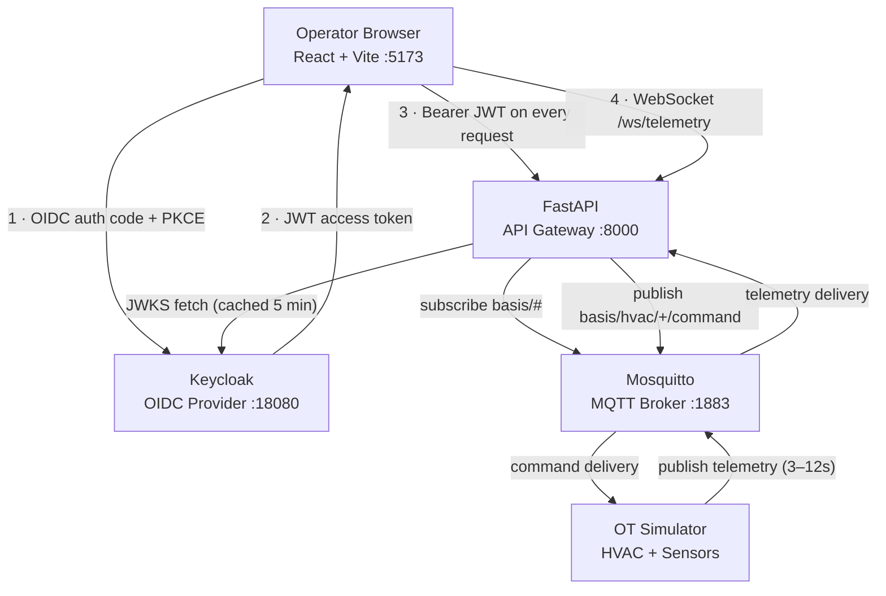
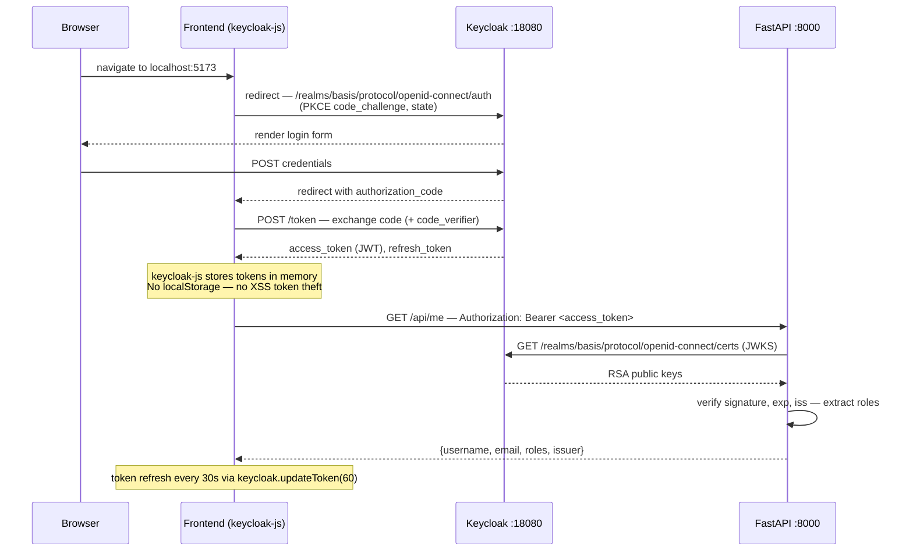
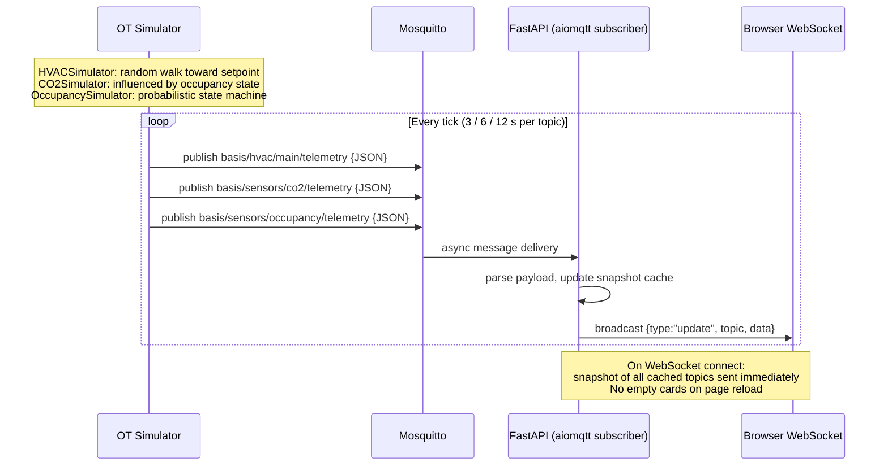
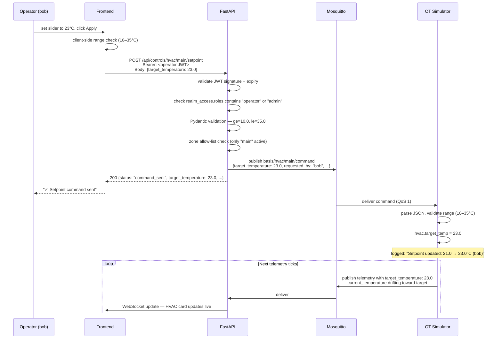

# Basis Foundation

A proof-of-concept demonstrating identity-aware access control applied to building automation and operational technology (OT) systems.

**Current status:** Stage 4 complete — local development environment, authentication, live telemetry, and role-gated operational commands are all functional. This is not a production system.

---

## Table of Contents

- [Problem Statement](#problem-statement)
- [Architecture](#architecture)
- [Identity and Authorization Model](#identity-and-authorization-model)
- [Authentication Flow](#authentication-flow)
- [Telemetry Flow](#telemetry-flow)
- [Operational Command Flow](#operational-command-flow)
- [Demo Role Matrix](#demo-role-matrix)
- [Local Development Setup](#local-development-setup)
- [Security Design Decisions](#security-design-decisions)
- [Current Limitations](#current-limitations)
- [Roadmap](#roadmap)
- [Project Structure](#project-structure)

---

## Problem Statement

Building automation and OT systems — HVAC controllers, access control systems, environmental sensors, energy management platforms — have historically operated on flat, trusted networks with weak or absent identity controls. Common patterns include shared credentials, no authentication on internal message buses, and coarse-grained access where any operator can issue any command to any device.

This creates compounding problems as these systems are networked:

- A technician with read-only dashboard access can issue override commands.
- There is no authoritative record of who issued which command and when.
- Broker-level access (e.g., MQTT) is typically all-or-nothing.
- Identity is asserted by clients rather than verified by an authoritative provider.

Basis Foundation explores what a properly identity-aware OT control plane looks like: one where every API call carries a cryptographically signed identity claim, every control command is authorized against a role policy before it reaches the physical system, and the audit trail is a first-class concern rather than an afterthought.

This PoC uses simulated building systems. The patterns are intended to be applicable to real BACnet, Modbus, or MQTT-connected devices behind an API gateway.

---

## Architecture

### Components

| Service | Technology | Role |
|---|---|---|
| **Identity Provider** | Keycloak 23 | OIDC/OAuth2 authority. Issues signed JWTs. Owns the role model. |
| **API Gateway** | FastAPI 0.4 | Validates JWTs, enforces role policy, bridges MQTT to WebSocket. |
| **Message Broker** | Mosquitto 2.0 | MQTT broker. Internal bus for telemetry and commands. |
| **OT Simulator** | Python | Simulates HVAC and environmental sensors. Publishes telemetry, subscribes to commands. |
| **Operator Console** | React + Vite | Browser SPA. OIDC login, live telemetry dashboard, role-gated control panel. |

All services run locally via Docker Compose. No cloud dependency. No Kubernetes.

### Architecture Diagram



### Running Application


*Carol (admin) logged in. All three telemetry cards are receiving live data over WebSocket. The HVAC control panel is unlocked because her JWT carries the `admin` realm role.*

### Data Flow Summary

Telemetry moves upward: Simulator → Mosquitto → API (subscriber) → WebSocket → Browser.

Commands move downward: Browser → API (role-checked) → Mosquitto → Simulator → physical state change → reflected in next telemetry tick.

The API is the sole trust boundary for commands. The MQTT broker itself is currently unauthenticated — devices are trusted once inside the internal Docker network. Hardening the broker is a planned stage.

---

## Identity and Authorization Model

### Realm and Clients

Keycloak hosts a realm named `basis`. Two clients are registered:

| Client | Type | Purpose |
|---|---|---|
| `basis-frontend` | Public (PKCE) | Browser SPA. Initiates OIDC auth code flow. |
| `basis-api` | Bearer-only | API reference. Token validation only, no login flow. |

### Roles

Three realm roles are defined. They are additive — each level grants access to everything below it in the hierarchy as implemented in the API's `require_role()` dependency.

| Role | Intended persona | Access level |
|---|---|---|
| `viewer` | Read-only dashboard consumer | Telemetry, dashboards |
| `operator` | Facilities technician | Telemetry + HVAC setpoint commands |
| `admin` | Facilities manager, platform operator | Telemetry + commands + audit logs (Stage 5) |

### Keycloak User Configuration


*The Keycloak admin console (`http://localhost:18080/admin`) showing the three demo users in the `basis` realm with their assigned realm roles. Accessible with credentials `admin` / `admin`.*

### JWT Structure

Keycloak issues RS256-signed JWTs. Realm roles are carried in the `realm_access` claim:

```json
{
  "iss": "http://localhost:18080/realms/basis",
  "sub": "a7b8c9d0-...",
  "preferred_username": "bob",
  "email": "bob@basis.local",
  "realm_access": {
    "roles": ["operator", "default-roles-basis", "offline_access"]
  },
  "exp": 1735000000
}
```

The API reads `realm_access.roles` after validating the token signature and expiry. Role claims are never accepted from the request body or query parameters.

### Token Validation

The API validates every protected request using Keycloak's JWKS endpoint:

1. Read `kid` (key ID) from the JWT header — identifies the RSA signing key.
2. Fetch `http://keycloak:8080/realms/basis/protocol/openid-connect/certs` (cached for 5 minutes, force-refreshed on unknown `kid` to handle key rotation).
3. Verify the RS256 signature using the matching JWK.
4. Verify `exp` (expiry) and `iss` (issuer matches `http://localhost:18080/realms/basis`).
5. Extract roles and apply the endpoint's `require_role()` constraint.

The issuer URL intentionally uses the browser-facing external address (`localhost:18080`), not the internal Docker hostname, because Keycloak derives the `iss` claim from the incoming request's `Host` header at token issuance time.

---

## Authentication Flow



---

## Telemetry Flow

MQTT topics follow the pattern `basis/{system}/{zone}/{message-type}`:

| Topic | Publisher | Cadence | Payload fields |
|---|---|---|---|
| `basis/hvac/main/telemetry` | Simulator | 3 s | `current_temperature`, `target_temperature`, `hvac_mode`, `fan_speed`, `zone`, `unit`, `timestamp` |
| `basis/sensors/co2/telemetry` | Simulator | 6 s | `co2_level`, `unit`, `status`, `timestamp` |
| `basis/sensors/occupancy/telemetry` | Simulator | 12 s | `occupancy_status`, `occupant_count`, `timestamp` |



The API maintains an in-memory snapshot (topic → latest payload). A client connecting mid-session receives a full snapshot immediately, then incremental updates.


*The three telemetry cards receiving live data. HVAC shows current temperature, setpoint, mode (heating/cooling/idle), and fan speed. CO₂ shows parts-per-million with a color-coded status bar. Occupancy shows the current headcount. All three update in place as WebSocket messages arrive — no page reload required.*

---

## Operational Command Flow

Commands travel the reverse path. The API is the sole entry point — no client publishes directly to the MQTT broker.

**Command topic:** `basis/hvac/{zone}/command`

**Command payload:**
```json
{
  "target_temperature": 23.0,
  "requested_by": "bob",
  "zone": "main",
  "timestamp": "2025-01-01T12:00:00+00:00"
}
```




*Bob (operator) submitting a new HVAC setpoint. The slider is set, Apply Setpoint was clicked, and the "✓ Setpoint command sent" confirmation is visible. The API validated his JWT, confirmed his `operator` role, and published the command to `basis/hvac/main/command`. The temperature card will begin drifting toward the new target within the next telemetry tick.*

### Validation layers

| Layer | Location | What it catches | Error returned |
|---|---|---|---|
| Range check | Frontend | Out-of-range before HTTP request | Input prevented |
| JWT validation | FastAPI | Missing/invalid/expired token | 401 Unauthorized |
| Role check | FastAPI | Valid token, wrong role | 403 Forbidden |
| Pydantic model | FastAPI | Wrong type, out of range, missing field | 422 Unprocessable Entity |
| Zone allow-list | FastAPI | Unknown zone identifier | 404 Not Found |
| Broker unavailable | FastAPI | Mosquitto unreachable | 503 Service Unavailable |
| Payload re-validation | Simulator | Malformed replayed messages | Logged and dropped |

---

## Demo Role Matrix

Three demo users are pre-seeded in Keycloak. All share the password `demo123`.

| User | Role | View telemetry | Send HVAC commands | View audit log |
|---|---|:---:|:---:|:---:|
| `alice` | viewer | ✅ | ❌ 403 | ❌ 403 |
| `bob` | operator | ✅ | ✅ | ❌ 403 |
| `carol` | admin | ✅ | ✅ | ✅ (Stage 5) |


*Alice (viewer) sees the locked panel. The frontend checks `hasRole('operator') || hasRole('admin')` before rendering the control UI — her `viewer` JWT passes this check as false, so the panel is replaced entirely with an explanation. A direct API call to `/api/controls/hvac/main/setpoint` with her token would return 403.*

The audit log endpoint exists in the role matrix but is not yet implemented. Carol receives a 200 from `/api/admin` today, but that endpoint currently returns a placeholder — it does not yet query a persistent log store.

---

## Local Development Setup

### Prerequisites

- Docker Desktop 4.x or later (includes Compose v2)
- No local Python, Node, or Java required

### Quick Start

```bash
git clone <repo-url> basis-poc
cd basis-poc
cp .env.example .env
docker compose up --build
```

First build takes 3–5 minutes (image pulls + `npm install` + `pip install`). Subsequent starts are fast due to Docker layer caching.

### Startup Sequence

Services start in dependency order:

```
Keycloak (imports basis realm from infra/keycloak/realm-export.json)
Mosquitto (MQTT broker, health-checked before dependents start)
    ↓
API (depends: Mosquitto healthy)    Simulator (depends: Mosquitto healthy)
    ↓
Frontend (depends: API started)
```

Keycloak starts in parallel and takes approximately 60–90 seconds to complete realm import. The API and frontend do not gate on Keycloak in the current setup — auth will begin working once Keycloak is ready.

### Service URLs

| Service | URL | Notes |
|---|---|---|
| Operator console | http://localhost:5173 | Log in to begin |
| API | http://localhost:8000 | |
| API docs (Swagger) | http://localhost:8000/docs | Paste a Bearer token to test protected endpoints |
| Keycloak realm | http://localhost:18080/realms/basis | Realm metadata |
| Keycloak admin | http://localhost:18080/admin | `admin` / `admin` |
| MQTT (TCP) | localhost:1883 | `mosquitto_sub -h localhost -p 1883 -t 'basis/#' -v` |
| MQTT (WebSocket) | localhost:9001 | Available for browser MQTT clients |

### Useful Commands

```bash
# Rebuild a specific service after code changes
docker compose up --build api

# Restart a single service without rebuilding
docker compose restart simulator

# Tail logs for one service
docker compose logs -f api

# Watch the full MQTT wire
mosquitto_sub -h localhost -p 1883 -t 'basis/#' -v

# Inspect the WebSocket stream directly
wscat -c ws://localhost:8000/ws/telemetry

# Full reset — wipes all volumes (Keycloak DB, MQTT data)
docker compose down -v && docker compose up --build
```

### Hot Reload

Source code is volume-mounted into each container. Changes to Python files trigger `uvicorn --reload` automatically. Changes to React files trigger Vite HMR automatically. Simulator changes require `docker compose restart simulator`.

---

## Security Design Decisions

### PKCE for the browser client

The frontend client (`basis-frontend`) is a public client — there is no client secret it can safely hold. PKCE (Proof Key for Code Exchange, S256) ensures the authorization code cannot be exchanged by an attacker who intercepts it. This is the correct pattern for browser-based OIDC clients.

### JWKS-based validation, not shared secrets

The API validates tokens using Keycloak's published RSA public keys (JWKS endpoint) rather than a shared secret. This means:
- The API never needs a copy of any private key or client secret.
- Key rotation is handled transparently — the API re-fetches JWKS on an unknown `kid`.
- The API can be deployed in environments with no direct configuration channel to Keycloak beyond the network endpoint.

### Role claims from the authoritative source

Roles are read from the JWT's `realm_access.roles` claim, which is set by Keycloak at token issuance and covered by the RS256 signature. The API does not accept role assertions from request bodies, headers, or query parameters.

### Separation of internal and external Keycloak URLs

The API uses two different Keycloak addresses:
- `http://keycloak:8080` — internal Docker hostname, used only for JWKS fetching.
- `http://localhost:18080` — external browser-facing URL, used for `iss` claim validation.

This is necessary because Keycloak's `iss` claim reflects the hostname the browser used at login time. Accepting the internal hostname for `iss` would allow forged tokens from any service inside the Docker network.

### Defense in depth on commands

Every command is validated at three independent layers: the frontend (prevents obvious user errors), FastAPI (enforces authorization policy and payload constraints), and the simulator (drops malformed messages regardless of source). The simulator's layer exists to defend against anything that can publish to the MQTT broker directly, which is presently unauthenticated.

### Tokens in memory only

`keycloak-js` stores tokens in memory, not `localStorage` or `sessionStorage`. This prevents token theft via XSS. The tradeoff is that tokens are lost on page reload, requiring a silent re-authentication via Keycloak's session cookie.

---

## Current Limitations

These are known gaps, not bugs. They represent the honest state of a Stage 4 PoC.

**Authentication and authorization**
- The WebSocket endpoint (`/ws/telemetry`) is currently unauthenticated. Any client that can reach port 8000 can receive telemetry. Stage 5 will add token validation via a query parameter on the WebSocket handshake.
- Token expiry is not handled on existing WebSocket connections — if a token expires mid-session, the WebSocket continues to stream until the page is reloaded.

**MQTT security**
- Mosquitto is configured for anonymous access with no TLS. This is acceptable on a Docker bridge network for local development. It is not acceptable in any networked environment.
- The simulator and API are trusted purely by virtue of being on the same Docker network. There is no per-client MQTT authentication.

**Persistence**
- Keycloak uses an H2 in-memory database (`dev-file` mode). User configuration is lost if the container is replaced without a volume backup. The realm is re-imported from `realm-export.json` on each fresh start.
- There is no audit log. Commands are logged to stdout only. There is no queryable record of who sent which command.

**Scope**
- A single zone (`main`) is simulated. There is no multi-zone, multi-building, or multi-tenant model.
- The simulator uses a simple random-walk model. It does not simulate device faults, communication loss, or sensor drift beyond Gaussian noise.
- There is no support for command acknowledgement or delivery confirmation from the simulator back to the API.

**Operations**
- All services are single instances. There is no high availability, horizontal scaling, or graceful degradation.
- No HTTPS. All traffic is plain HTTP and WS.
- No production Keycloak configuration (no PostgreSQL backend, no clustering, no SMTP).

---

## Roadmap

The following stages are planned but not yet started. This list reflects intended direction, not committed scope.

| Stage | Goal | Key deliverables |
|---|---|---|
| **Stage 5** | Audit logging | SQLite audit log via FastAPI middleware. Every command recorded with user, role, timestamp, outcome. `/api/audit` endpoint (admin only). |
| **Stage 6** | MQTT security | Mosquitto authentication with per-client credentials. TLS on MQTT port. API and simulator use distinct credentials. |
| **Stage 7** | WebSocket authentication | Token validation on WebSocket handshake. Token expiry handling on live connections. |
| **Stage 8** | Multi-zone support | Zone registry. Multiple simulated zones. Scoped commands (`basis/hvac/{zone}/command`). Zone-level role grants. |
| **Stage 9** | Production hardening | Keycloak with PostgreSQL backend. HTTPS via reverse proxy. Production Compose overrides. Secrets management baseline. |
| **Stage 10** | Real device integration | BACnet/IP or Modbus TCP adapter alongside the simulator. Read real sensor data. Gate real actuator commands behind the same auth layer. |

Basis Foundation does not currently have a target deployment architecture for production. The intent is to validate the identity and authorization model at the application level before introducing infrastructure complexity.

---

## Project Structure

```
basis-poc/
├── docker-compose.yml              # All services, networks, volumes
├── .env.example                    # Reference configuration — copy to .env
├── .gitignore
├── README.md
│
├── infra/
│   ├── keycloak/
│   │   └── realm-export.json       # basis realm: roles, clients, demo users
│   └── mosquitto/
│       └── mosquitto.conf          # Broker config: listeners, logging
│
└── services/
    ├── api/                        # FastAPI backend
    │   ├── Dockerfile
    │   ├── requirements.txt
    │   ├── main.py                 # App factory, lifecycle, public routes
    │   ├── auth.py                 # JWKS fetch, JWT validation, require_role()
    │   ├── mqtt_client.py          # aiomqtt subscriber — background asyncio task
    │   ├── mqtt_publisher.py       # paho publish.single() — fire-and-forget commands
    │   ├── ws_manager.py           # WebSocket broadcaster — snapshot + fan-out
    │   └── routers/
    │       ├── protected.py        # /api/me, /api/viewer, /api/operator, /api/admin
    │       ├── telemetry.py        # /ws/telemetry — WebSocket endpoint
    │       └── controls.py         # /api/controls/hvac/{zone}/setpoint
    │
    ├── frontend/                   # React + Vite SPA
    │   ├── Dockerfile
    │   ├── package.json
    │   ├── vite.config.js
    │   ├── index.html
    │   └── src/
    │       ├── App.jsx             # Root — auth state, telemetry state, layout
    │       ├── auth/
    │       │   └── keycloak.js     # Keycloak singleton, initKeycloak(), hasRole()
    │       ├── api/
    │       │   └── client.js       # apiFetch() — token refresh + Bearer header
    │       ├── ws/
    │       │   └── telemetry.js    # useTelemetry() — WebSocket hook, reconnect backoff
    │       └── components/
    │           ├── TelemetryDashboard.jsx  # HVAC, CO2, Occupancy cards
    │           └── ControlPanel.jsx        # Setpoint slider — gated by hasRole()
    │
    └── simulator/                  # OT device simulator
        ├── Dockerfile
        ├── requirements.txt
        └── simulator.py            # HVACSimulator, CO2Simulator, OccupancySimulator
                                    # Subscribes to basis/hvac/+/command
```

---

## Development Notes

This repository is structured for local development clarity, not for production deployment. The service boundaries are intentionally coarse — the API is a monolith, the simulator is a single process, and all configuration is in environment variables rather than a secrets manager.

The primary value of this PoC is demonstrating the **identity model** and **authorization enforcement pattern** at the application layer. Infrastructure concerns (HA, TLS, secrets, deployment) are deliberately deferred.

Contributions and questions welcome. Open an issue before submitting significant structural changes.
