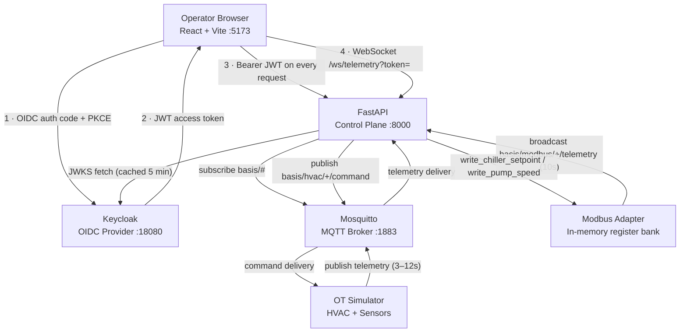
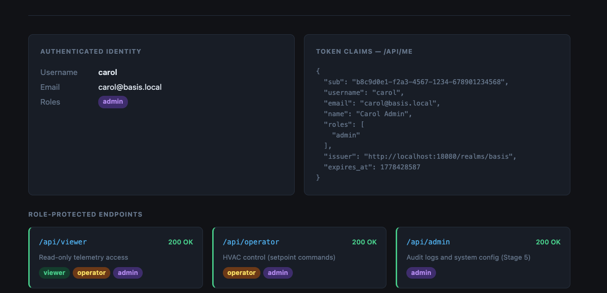
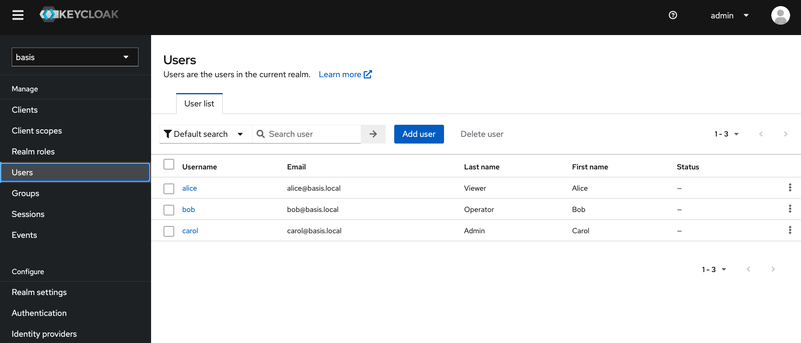
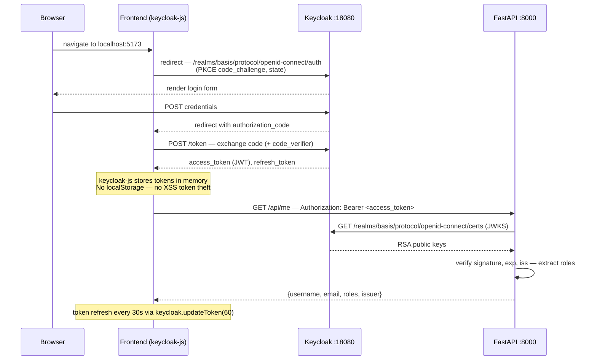
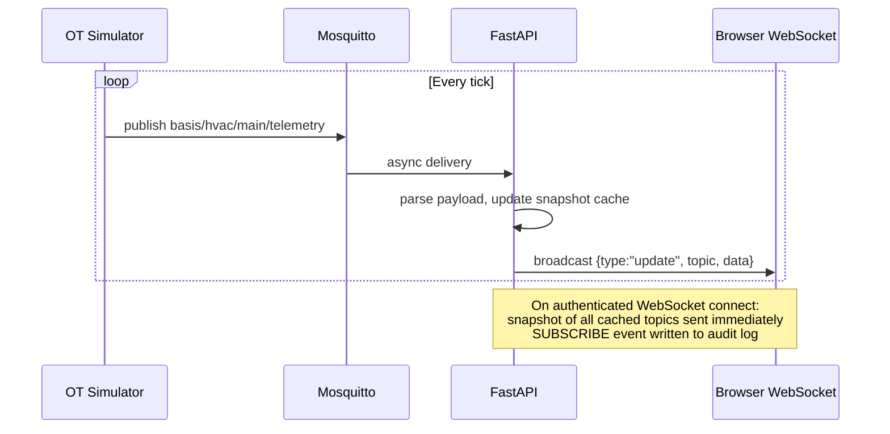
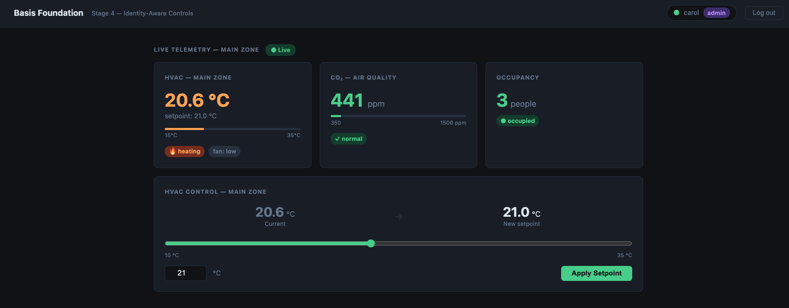
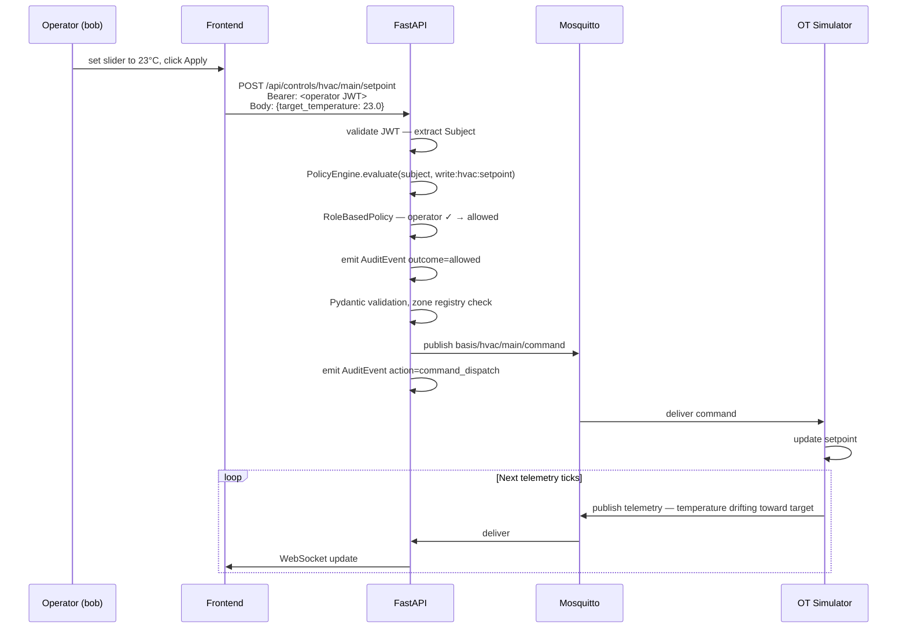
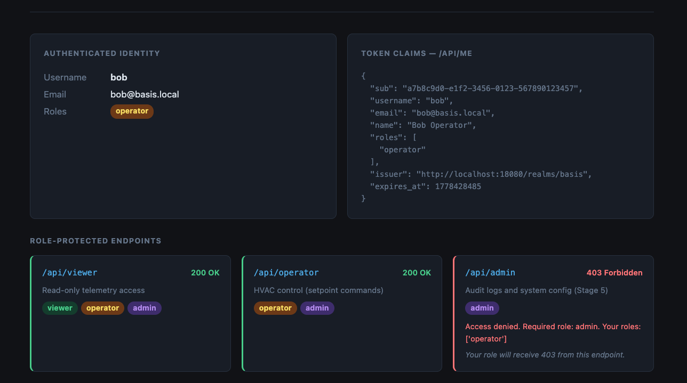
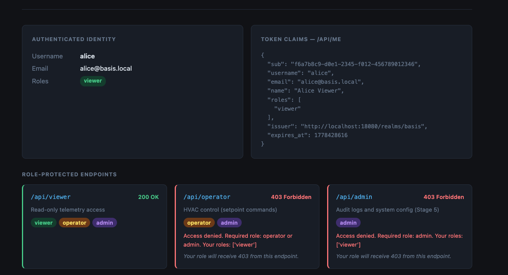

# Basis Foundation

**An identity and policy control plane for operational technology (OT) environments.**

BASIS validates what happens when you apply modern identity infrastructure — cryptographically signed tokens, action-based authorization policy, chain-of-responsibility evaluation, and durable audit trails — to building automation and industrial control systems that have historically operated without it.

The platform runs entirely on Docker Compose. No cloud. No Kubernetes. No external dependencies.

---

## Try It in GitHub Codespaces

The fastest way to explore BASIS is in a GitHub Codespace. No local Docker setup required.

[](https://codespaces.new/basis-foundation/basis-poc)

**Expected experience:**

1. Click the badge above and wait for the Codespace to initialize (3–5 minutes on first start).
2. The environment builds and starts all services automatically — no commands to run.
3. Keycloak takes an additional 60–90 seconds to complete realm import. Wait for the setup log to confirm readiness.
4. The Operator Console opens automatically in your browser (port 5173).
5. Log in as any of the three demo users and explore the control plane.

**Demo credentials** (password: `demo123` for all):

| User    | Role     | What you can do                             |
| ------- | -------- | ------------------------------------------- |
| `alice` | viewer   | Live telemetry dashboard only               |
| `bob`   | operator | Telemetry + HVAC setpoint + Modbus commands |
| `carol` | admin    | Full access + audit log                     |

**5-minute demo walkthrough:**

1. Log in as `bob` (operator). Watch live HVAC, CO₂, and occupancy telemetry arrive via WebSocket. Scroll down on the Dashboard to see the **Data Center** section: rack inlet temperatures, hot/cold aisle thermals, CRAC cooling unit, PDU load, UPS battery state, and environmental sensors — all streaming live from the simulator.
2. Use the HVAC setpoint slider to issue a temperature command. Observe the temperature drift in the telemetry card.
3. Log out. Log in as `alice` (viewer). The control panel is locked — a direct API call also returns 403. The data center telemetry is still visible (telemetry is viewer-accessible), but no control actions are available.
4. Log out. Log in as `carol` (admin). Open the **Audit Trail** tab in the Operator Console sidebar. Every action bob and alice took — including alice's 403 — appears as a timestamped event with subject, action, resource, and outcome.
5. Read `docs/architecture/overview.md` and `docs/adr/` for the architectural reasoning behind each design decision.

> **Developer note:** The raw API is also browsable at `http://localhost:8000/docs` (Swagger UI). Protected endpoints require a Bearer token — paste one from your browser's dev tools Network tab. The Operator Console handles token injection automatically and is the recommended way to explore the platform.

**Codespaces notes:**

- Startup is slower than local Docker because images are pulled and built on the Codespace VM.
- Subsequent restarts are faster (~60s, dominated by Keycloak) since images are cached.
- All traffic stays within the Codespace — nothing is sent to external services.
- The Codespace environment is a convenience layer; the underlying BASIS architecture is unchanged.

---

## Table of Contents

- [Try It in GitHub Codespaces](#try-it-in-github-codespaces)
- [What BASIS Is and Is Not](#what-basis-is-and-is-not)
- [Problem Statement](#problem-statement)
- [The Control Plane Model](#the-control-plane-model)
- [Architecture](#architecture)
- [Identity and Authorization Model](#identity-and-authorization-model)
- [Authentication Flow](#authentication-flow)
- [Telemetry Flow](#telemetry-flow)
- [Operational Command Flow](#operational-command-flow)
- [Demo Role Matrix](#demo-role-matrix)
- [Potential Future Applications](#potential-future-applications)
- [Local Development Setup](#local-development-setup)
- [GitHub Codespaces Setup](#github-codespaces-setup)
- [Security Design Decisions](#security-design-decisions)
- [Architecture Documentation](#architecture-documentation)
- [Architecture Decision Records](#architecture-decision-records)
- [Current Limitations](#current-limitations)
- [Roadmap](#roadmap)
- [Project Structure](#project-structure)

---

## What BASIS Is and Is Not

### BASIS is:

- **An architecture validation platform** for identity-aware OT control. It exists to answer a specific question: what does a proper control plane look like for systems that currently have none?
- **A working reference implementation** of a layered security pattern — JWT-based identity, named action authorization, chain-of-responsibility policy evaluation, protocol-agnostic adapter lifecycle, and durable audit trails.
- **A local-first, air-gap-compatible prototype** that runs entirely on Docker Compose without cloud connectivity. The design philosophy treats network isolation as a feature, not a constraint.
- **A platform for exploring OT identity architecture** before committing to infrastructure. The staging model lets each design decision be validated in isolation before the next layer is added.

### BASIS is not:

- **A production system.** MQTT runs without TLS, all traffic is plain HTTP and WS, Keycloak uses an H2 development database, and there is no secrets management. These are known, deliberate gaps in a platform prototype.
- **A real Modbus, BACnet, or OPC-UA implementation.** The Modbus adapter manages an in-memory register bank. It demonstrates the adapter contract and authorization path — not a fieldbus driver.
- **A replacement for industrial-grade SCADA, DCS, or BAS platforms.** BASIS is not competing with Niagara, Ignition, or Tridium. It is a pattern demonstration.
- **A security product ready for any deployment.** Do not deploy BASIS or its configuration patterns to production systems without a full security review.

---

## Problem Statement

Building automation and OT systems — HVAC controllers, access control systems, environmental sensors, energy management platforms — have historically operated on flat, trusted networks with weak or absent identity controls. Common patterns include shared credentials, no authentication on internal message buses, and coarse-grained access where any operator can issue any command to any device.

This creates compounding problems as these systems are networked:

- A technician with read-only dashboard access can issue override commands.
- There is no authoritative record of who issued which command and when.
- Broker-level access (e.g., MQTT) is typically all-or-nothing.
- Identity is asserted by clients rather than verified by an authoritative provider.
- Multiple OT protocols (Modbus, BACnet, MQTT) each have separate — or absent — access control mechanisms with no unified policy.

BASIS explores what a properly identity-aware OT control plane looks like: one where every API call carries a cryptographically signed identity claim, every control command is authorized against a role policy before it reaches the physical system, and the audit trail is a first-class concern rather than an afterthought.

---

## The Control Plane Model

In networking, a control plane governs _how_ traffic should flow — it makes decisions. The data plane actually moves packets.

BASIS applies this separation to OT:

- The **data plane** is the physical layer: MQTT brokers, Modbus buses, BACnet/IP networks, sensors, actuators. These move measurements and commands.
- The **control plane** is BASIS: identity verification, authorization policy, command gating, and audit. It decides _who may do what to which device_ before anything reaches the data plane.

Without a control plane, OT systems authenticate (if at all) at the protocol level — a Modbus master can issue any write to any register it can reach. BASIS intercepts at the API boundary: no command reaches the protocol layer until the PolicyEngine evaluates it against the role table and emits an audit record.

This model is **protocol-agnostic by design.** The same PolicyEngine, the same `require_action()` dependency, and the same audit logger govern HVAC setpoints over MQTT and chiller setpoints over simulated Modbus TCP. Adding a new protocol adapter requires no changes to the security path — only a new adapter implementing `AdapterBase` and a new action constant in `policy/actions.py`.

### Core concepts

| Concept             | Role in BASIS                                                                                                                                                   |
| ------------------- | --------------------------------------------------------------------------------------------------------------------------------------------------------------- |
| **Subject**         | Who is acting. Parsed from the JWT at the auth boundary. Typed: HUMAN, DEVICE, SERVICE, GATEWAY, AGENT.                                                         |
| **Action**          | What is being attempted. Named constants like `write:hvac:setpoint`, `write:modbus:setpoint`, `read:audit:log`. Stable — they appear verbatim in audit records. |
| **Resource**        | What is being acted on. Typed objects in a registry: HVAC controllers, sensors, devices, zones.                                                                 |
| **PolicyEngine**    | Chain-of-responsibility evaluator. Each policy in the chain may allow, deny, or pass.                                                                           |
| **RoleBasedPolicy** | The current policy. Maps actions to the roles that may perform them. One table, one place.                                                                      |
| **AuditEvent**      | Immutable record of every authorization decision and command dispatch. Written to stdout and SQLite.                                                            |

---

## Architecture

### Components

| Service               | Technology    | Role                                                                                                   |
| --------------------- | ------------- | ------------------------------------------------------------------------------------------------------ |
| **Identity Provider** | Keycloak 23   | OIDC/OAuth2 authority. Issues RS256-signed JWTs. Owns the role model.                                  |
| **API Gateway**       | FastAPI 0.10  | Validates JWTs, evaluates PolicyEngine, bridges adapters to WebSocket.                                 |
| **Message Broker**    | Mosquitto 2.0 | MQTT broker. Internal bus for HVAC/sensor telemetry and commands. Credentials required.                |
| **OT Adapters**       | Python        | MqttAdapter (HVAC, CO₂, occupancy) and ModbusTcpAdapter (chiller, pump). Both implement `AdapterBase`. |
| **OT Simulator**      | Python        | Simulates HVAC and environmental sensors. Publishes MQTT telemetry, subscribes to commands.            |
| **Operator Console**  | React + Vite  | Browser SPA. OIDC login via PKCE, live telemetry dashboard, role-gated control panel.                  |

All services run locally via Docker Compose. No cloud dependency. No Kubernetes.

### Architecture Diagram



### Running Application



_Carol (admin) logged in. All three telemetry cards are receiving live data over an authenticated WebSocket. The HVAC control panel is unlocked because her JWT carries the `admin` realm role._

### Data Flow Summary

Telemetry moves upward: Simulator → Mosquitto → API (MQTT adapter) → WebSocket → Browser. The Modbus adapter emits telemetry directly to the broadcaster on its own 10-second tick.

Commands move downward: Browser → API (PolicyEngine evaluated) → adapter → protocol → physical state change → reflected in next telemetry tick.

The API is the sole trust boundary for commands. No client publishes directly to the MQTT broker or writes to any register. Every command crosses the control plane.

---

## Identity and Authorization Model

### Realm and Clients

Keycloak hosts a realm named `basis`. Two clients are registered:

| Client           | Type          | Purpose                                              |
| ---------------- | ------------- | ---------------------------------------------------- |
| `basis-frontend` | Public (PKCE) | Browser SPA. Initiates OIDC auth code flow.          |
| `basis-api`      | Bearer-only   | API reference. Token validation only, no login flow. |

### Roles

Three realm roles are defined. They are additive — each level grants access to everything at lower levels as encoded in the `_ACTION_ROLES` table in `policy/rbac.py`.

| Role       | Intended persona                      | Access level                                         |
| ---------- | ------------------------------------- | ---------------------------------------------------- |
| `viewer`   | Read-only dashboard consumer          | Telemetry, resource registry, dashboards             |
| `operator` | Facilities technician                 | Telemetry + HVAC setpoint commands + Modbus commands |
| `admin`    | Facilities manager, platform operator | Telemetry + commands + audit logs                    |

### Keycloak User Configuration



_The Keycloak admin console (`http://localhost:18080/admin`) showing the three demo users in the `basis` realm with their assigned realm roles._

### JWT Structure

Keycloak issues RS256-signed JWTs. Realm roles are carried in the `realm_access` claim:

```json
{
  "iss": "http://localhost:18080/realms/basis",
  "sub": "a7b8c9d0-...",
  "preferred_username": "bob",
  "email": "bob@basis.local",
  "realm_access": {
    "roles": ["operator", "default-roles-basis", "offline_access"]
  },
  "exp": 1735000000
}
```

The API reads `realm_access.roles` after validating the token signature and expiry. Role claims are never accepted from the request body or query parameters.

### Action-Based Authorization

Endpoints do not check roles directly. They declare what action they perform:

```python
subject: Subject = Depends(require_action(actions.WRITE_HVAC_SETPOINT))
```

The `policy/rbac.py` table maps actions to the roles that may perform them:

```python
actions.WRITE_HVAC_SETPOINT:    {"operator", "admin"},
actions.WRITE_MODBUS_SETPOINT:  {"operator", "admin"},
actions.SUBSCRIBE_TELEMETRY:    {"viewer", "operator", "admin"},
actions.READ_AUDIT_LOG:         {"admin"},
```

To grant a new role access to an action: one change in `rbac.py`. The router is untouched. Action names appear verbatim in audit records and are treated as stable identifiers — renaming them breaks audit trail continuity.

---

## Authentication Flow



---

## Telemetry Flow

### Data Center Telemetry

The simulator also publishes a composite data center telemetry event every ~9 seconds on `basis/datacenter/dc-boise-01/telemetry`. The payload covers six subsystems in a single message:

| Field group  | Key signals                                                        |
| ------------ | ------------------------------------------------------------------ |
| `racks[]`    | Per-rack inlet temperature + status (normal / warning / critical)  |
| `thermal`    | Cold aisle temp, hot aisle temp, ΔT                                |
| `cooling`    | CRAC unit mode, fan speed %, supply/return air temps               |
| `power`      | PDU load %, kW draw, status (normal / warning / overload)          |
| `ups`        | Battery %, runtime, utility power state, status                    |
| `environment`| Humidity %, leak detected, smoke detected                          |

This demonstrates why BASIS matters for AI-era infrastructure: GPU clusters and edge inference nodes are dense, high-power, thermally critical systems. An unauthorized command to a CRAC unit or PDU — without identity verification or audit — can cascade into rack shutdowns. BASIS gates every such action through the same `require_action()` policy path used for HVAC, producing a verifiable audit record of every control decision.

### MQTT Telemetry (HVAC, CO₂, Occupancy)

MQTT topics follow the pattern `basis/{system}/{zone}/{message-type}`:

| Topic                                      | Publisher | Cadence | Key payload fields                                                    |
| ------------------------------------------ | --------- | ------- | --------------------------------------------------------------------- |
| `basis/hvac/main/telemetry`                | Simulator | 3 s     | `current_temperature`, `target_temperature`, `hvac_mode`, `fan_speed` |
| `basis/sensors/co2/telemetry`              | Simulator | 6 s     | `co2_level`, `unit`, `status`                                         |
| `basis/sensors/occupancy/telemetry`        | Simulator | 12 s    | `occupancy_status`, `occupant_count`                                  |
| `basis/datacenter/dc-boise-01/telemetry`   | Simulator | 9 s     | `racks[]`, `thermal{}`, `cooling{}`, `power{}`, `ups{}`, `environment{}` |

### Modbus Telemetry (Chiller, Pump)

The Modbus adapter publishes synthetic telemetry to the broadcaster directly (no MQTT hop):

| Synthetic topic                    | Cadence | Key payload fields                                         |
| ---------------------------------- | ------- | ---------------------------------------------------------- |
| `basis/modbus/chiller-1/telemetry` | 10 s    | `supply_temp_setpoint_c`, `supply_temp_actual_c`, `status` |
| `basis/modbus/pump-1/telemetry`    | 10 s    | `speed_pct`, `flow_lpm`, `status`                          |

### WebSocket Authentication

WebSocket connections require a valid JWT passed as a query parameter:

```
ws://localhost:8000/ws/telemetry?token=<access_token>
```

| Close code | Meaning                                                    |
| ---------- | ---------------------------------------------------------- |
| `4000`     | Authentication or authorization failure — do not reconnect |
| `4001`     | Token expired mid-session — refresh and reconnect          |

The frontend handles 4001 automatically: it calls `keycloak.updateToken()` then reconnects immediately.



The API maintains an in-memory snapshot (topic → latest payload). A client connecting mid-session receives a full snapshot immediately, then incremental updates. Each WebSocket session is identity-bound — the subject name, roles, and token expiry are recorded in a `TelemetrySession` at connect time. Session duration is included in the DISCONNECT audit event.



_Three telemetry cards receiving live data over an authenticated WebSocket connection._

---

## Operational Command Flow

Commands travel the reverse path. The API is the sole entry point — no client writes to the MQTT broker or Modbus registers directly.

### HVAC Command (MQTT)

**Endpoint:** `POST /api/controls/hvac/{zone}/setpoint`

**Authorization:** `write:hvac:setpoint` — operator, admin



### Modbus Command (Modbus TCP Adapter)

**Endpoints:**

- `POST /api/controls/modbus/chiller-1/setpoint` — chiller supply temperature (°C)
- `POST /api/controls/modbus/pump-1/speed` — pump speed (%)

**Authorization:** `write:modbus:setpoint` — operator, admin

The Modbus command path uses identical security infrastructure. `require_action(WRITE_MODBUS_SETPOINT)` invokes the same PolicyEngine, the same RoleBasedPolicy evaluation, and the same audit logger as the HVAC path. Two audit events are emitted per successful command: one for authorization, one for command delivery. This is the architectural proof of Stage 10 — a new OT protocol required no changes to auth, policy, or audit infrastructure.



_Bob (operator) submitting a new HVAC setpoint. The API validated his JWT, evaluated `write:hvac:setpoint` via the PolicyEngine, confirmed his `operator` role, and published the command to the MQTT broker._

### Validation Layers

| Layer                 | Location  | What it catches                            | Error returned           |
| --------------------- | --------- | ------------------------------------------ | ------------------------ |
| Range check           | Frontend  | Out-of-range before HTTP request           | Input prevented          |
| JWT validation        | FastAPI   | Missing/invalid/expired token              | 401 Unauthorized         |
| PolicyEngine          | FastAPI   | Valid token, action not permitted for role | 403 Forbidden            |
| Pydantic model        | FastAPI   | Wrong type, out of range, missing field    | 422 Unprocessable Entity |
| Resource registry     | FastAPI   | Unknown zone or device identifier          | 404 Not Found            |
| Adapter unavailable   | FastAPI   | Broker or register bank unreachable        | 503 Service Unavailable  |
| Payload re-validation | Simulator | Malformed replayed MQTT messages           | Logged and dropped       |

---

## Demo Role Matrix

Three demo users are pre-seeded in Keycloak. All share the password `demo123`.

| User    | Role     | Telemetry | HVAC commands | Modbus commands | Audit log |
| ------- | -------- | :-------: | :-----------: | :-------------: | :-------: |
| `alice` | viewer   |    ✅     |    ❌ 403     |     ❌ 403      |  ❌ 403   |
| `bob`   | operator |    ✅     |      ✅       |       ✅        |  ❌ 403   |
| `carol` | admin    |    ✅     |      ✅       |       ✅        |    ✅     |



_Alice (viewer) sees the locked panel. The frontend renders the restriction UI based on `hasRole('operator') || hasRole('admin')`. A direct API call to any command endpoint with her token returns 403 — the policy boundary is enforced server-side regardless of what the UI renders._

The audit log (`GET /api/audit`) is admin-only and backed by a SQLite store with filtering by subject, action, outcome, and resource. SUBSCRIBE and DISCONNECT events for WebSocket sessions are included — the audit trail covers the full session lifecycle.

---

## Potential Future Applications

BASIS validates a pattern that could be applied to real OT environments in several ways. These are architectural directions, not product commitments.

**API gateway in front of existing BAS infrastructure.** A building with a mix of Modbus, BACnet/IP, and MQTT devices could place a BASIS-style control plane at the edge — normalizing authentication and authorization across protocols without replacing the underlying systems. Each protocol gets an adapter; the security model is shared.

**Unified identity plane for mixed-protocol OT environments.** As IT/OT convergence increases, the absence of a common identity model is a significant operational gap. A control plane that treats all protocol adapters identically — same subject model, same policy table, same audit format — makes cross-protocol authorization auditable in a single log.

**Audit-first compliance infrastructure.** Frameworks like NERC CIP, NIST SP 800-82, and IEC 62443 require demonstrable access control and audit trails for operational systems. The ACTION → ROLES → AuditEvent pattern produces the kind of structured, queryable records that compliance audits need. Every authorization decision and command dispatch is persisted with subject identity, action name, resource, outcome, and timestamp.

**Zero-trust architecture prototype for OT.** Zero trust assumes no implicit network trust — every request is authenticated and authorized regardless of origin. OT networks have historically been the opposite: flat, trusted, perimeter-defended. BASIS demonstrates what zero-trust-style controls look like at the OT application layer, without requiring changes to physical network topology.

**Multi-tenant facilities management.** The zone model in the resource registry points toward a future where policy grants are scoped to zones: an operator for Building A cannot issue commands to Building B's HVAC. The subject, action, and resource models are designed to support zone-scoped policy evaluation as a natural extension.

---

## Local Development Setup

### Prerequisites

- Docker Desktop 4.x or later (includes Compose v2)
- No local Python, Node, or Java required

### Quick Start

```bash
git clone <repo-url> basis-poc
cd basis-poc
cp .env.example .env
docker compose up --build
```

First build takes 3–5 minutes (image pulls + `npm install` + `pip install`). Subsequent starts are fast due to Docker layer caching.

### Startup Sequence

Services start in dependency order:

```
Keycloak (imports basis realm from infra/keycloak/realm-export.json)
Mosquitto (MQTT broker, health-checked before dependents start)
    ↓
API (depends: Mosquitto healthy)    Simulator (depends: Mosquitto healthy)
    ↓
Frontend (depends: API started)
```

Keycloak starts in parallel and takes approximately 60–90 seconds to complete realm import. The API and frontend do not gate on Keycloak in the current setup — auth will begin working once Keycloak is ready.

### Service URLs

| Service            | URL                                 | Notes                                            |
| ------------------ | ----------------------------------- | ------------------------------------------------ |
| Operator console   | http://localhost:5173               | Log in to begin                                  |
| API                | http://localhost:8000               |                                                  |
| API docs (Swagger) | http://localhost:8000/docs          | Paste a Bearer token to test protected endpoints |
| Keycloak realm     | http://localhost:18080/realms/basis | Realm metadata                                   |
| Keycloak admin     | http://localhost:18080/admin        | `admin` / `admin`                                |
| MQTT (TCP)         | localhost:1883                      | Credentials required — see `.env.example`        |
| MQTT (WebSocket)   | localhost:9001                      | Available for browser MQTT clients               |

### Useful Commands

```bash
# Rebuild a specific service after code changes
docker compose up --build api

# Restart a single service without rebuilding
docker compose restart simulator

# Tail logs for one service
docker compose logs -f api

# Watch the full MQTT wire (credentials required)
mosquitto_sub -h localhost -p 1883 -u basis-api -P basis-api-secret -t 'basis/#' -v

# Query the audit log (admin token required)
curl -s -H "Authorization: Bearer <carol-token>" \
  "http://localhost:8000/api/audit?limit=20" | python3 -m json.tool

# Inspect audit events for a specific action
curl -s -H "Authorization: Bearer <carol-token>" \
  "http://localhost:8000/api/audit?action=write%3Amodbus%3Asetpoint"

# Full reset — wipes all volumes (Keycloak DB, audit DB, MQTT data)
docker compose down -v && docker compose up --build
```

### Hot Reload

Source code is volume-mounted into each container. Changes to Python files trigger `uvicorn --reload` automatically. Changes to React files trigger Vite HMR automatically. Simulator changes require `docker compose restart simulator`.

---

## GitHub Codespaces Setup

Codespaces provides a cloud-hosted development environment where BASIS runs exactly as it does locally — same Docker Compose stack, same services, same architecture. The environment is configured automatically; no manual steps are required after the Codespace starts.

### What the environment configures automatically

When the Codespace is first created, `.devcontainer/scripts/post-create.sh` runs and:

1. Copies `.env.example` to `.env` and rewrites `localhost` URLs to Codespaces forwarded-port URLs.
2. Sets `KC_PROXY=edge` so Keycloak correctly constructs its issuer URL behind the Codespaces HTTPS proxy. This ensures JWT `iss` claims match what the API expects.
3. Runs `docker compose up --build -d` to build all images and start all services.
4. Waits for Keycloak to complete realm import (60–90 seconds).
5. Patches the `basis-frontend` OIDC client's redirect URIs via the Keycloak admin API, adding the Codespaces frontend URL alongside the existing `localhost:5173` entries.
6. Prints a welcome message with all service URLs and demo credentials.

When a Codespace is **resumed** after being stopped, `.devcontainer/scripts/post-start.sh` repeats steps 3–5 (images are already built, so step 3 is fast — ~60–90s total, dominated by Keycloak).

### Why Keycloak requires patching at runtime

The Keycloak realm is imported from `infra/keycloak/realm-export.json`, which registers `http://localhost:5173` as the valid redirect URI for the `basis-frontend` OIDC client. In Codespaces, the browser accesses the frontend via a `https://{name}-5173.app.github.dev` URL, which would fail Keycloak's redirect URI validation.

The post-create script adds the Codespaces URL to the client's redirect URIs via the admin API. This is a runtime configuration change — the `realm-export.json` is not modified, so local development is unaffected.

### Service URLs in Codespaces

Forwarded-port URLs follow the pattern `https://{codespace-name}-{port}.app.github.dev`:

| Service          | Port  | URL pattern                                 |
| ---------------- | ----- | ------------------------------------------- |
| Operator Console | 5173  | `https://{name}-5173.app.github.dev`        |
| API (Swagger UI) | 8000  | `https://{name}-8000.app.github.dev/docs`   |
| Keycloak admin   | 18080 | `https://{name}-18080.app.github.dev/admin` |
| MQTT (TCP)       | 1883  | Not usable from browser; internal only      |
| MQTT (WebSocket) | 9001  | `wss://{name}-9001.app.github.dev`          |

The VS Code Ports panel shows live URLs for your specific Codespace.

### Useful commands in Codespaces

These are the same commands as local development — the environment is identical:

```bash
# Check which services are running
docker compose ps

# Follow logs for a specific service
docker compose logs -f api
docker compose logs -f keycloak

# Restart a service after code changes (hot reload handles Python/React automatically)
docker compose restart simulator

# Full reset — wipes all state and rebuilds from scratch
docker compose down -v && docker compose up --build -d

# Query the audit log (requires a Carol token — copy from browser dev tools)
curl -s -H "Authorization: Bearer <carol-token>" \
  "http://localhost:8000/api/audit?limit=20" | python3 -m json.tool

# Watch the MQTT wire
mosquitto_sub -h localhost -p 1883 -u basis-api -P basis-api-secret -t 'basis/#' -v
```

### Troubleshooting

**The Operator Console shows "Services are starting, please wait…"**

This is normal on first launch. The console automatically retries connecting to Keycloak up to 8 times (5 seconds apart) while services initialize. Wait for the attempt counter to reach success — no action needed.

**The Operator Console shows "Authentication Failed" after all retries**

Keycloak may have taken longer than expected. Check:

```bash
docker compose logs keycloak | tail -30
curl http://localhost:18080/realms/basis
```

If Keycloak is ready but auth still fails, the redirect URI patch may not have run. Re-run it manually:

```bash
bash .devcontainer/scripts/post-start.sh
```

**Login redirects to the wrong URL or shows a "redirect_uri mismatch" error**

This means the Codespaces frontend URL wasn't added to Keycloak's redirect URIs. Re-run the post-start script, which re-patches the client:

```bash
bash .devcontainer/scripts/post-start.sh
```

**Telemetry cards show "reconnecting" but don't receive data**

The WebSocket connects to the API via the forwarded port. Verify the API is healthy:

```bash
curl http://localhost:8000/health
docker compose logs api | tail -20
```

**Services won't start or docker compose fails**

Check available disk space and Docker daemon health:

```bash
docker info
df -h
docker compose logs
```

If the Codespace VM is out of resources, try a full reset:

```bash
docker compose down -v
docker system prune -f
docker compose up --build -d
```

**Codespace was stopped and restarted — services aren't running**

The post-start script should handle this automatically. If it didn't, bring services up manually:

```bash
docker compose up -d
bash .devcontainer/scripts/post-start.sh
```

### Local development with VS Code Dev Containers

The same `.devcontainer/devcontainer.json` works with VS Code Dev Containers locally if you have Docker Desktop installed. Open the project folder in VS Code and click "Reopen in Container" when prompted. The setup is identical to Codespaces, except URLs remain `localhost`-based.

---

## Security Design Decisions

### PKCE for the browser client

The frontend client (`basis-frontend`) is a public client — there is no client secret it can safely hold. PKCE (Proof Key for Code Exchange, S256) ensures the authorization code cannot be exchanged by an attacker who intercepts it. This is the correct pattern for browser-based OIDC clients.

### JWKS-based validation, not shared secrets

The API validates tokens using Keycloak's published RSA public keys (JWKS endpoint) rather than a shared secret. This means the API never needs a copy of any private key or client secret. Key rotation is handled transparently — the API re-fetches JWKS on an unknown `kid`. The API can be deployed in environments with no direct configuration channel to Keycloak beyond the network endpoint.

### Role claims from the authoritative source

Roles are read from the JWT's `realm_access.roles` claim, which is set by Keycloak at token issuance and covered by the RS256 signature. The API does not accept role assertions from request bodies, headers, or query parameters.

### Separation of internal and external Keycloak URLs

The API uses two different Keycloak addresses:

- `http://keycloak:8080` — internal Docker hostname, used only for JWKS fetching.
- `http://localhost:18080` — external browser-facing URL, used for `iss` claim validation.

This is necessary because Keycloak's `iss` claim reflects the hostname the browser used at login time. Accepting the internal hostname for `iss` would allow forged tokens from any service inside the Docker network.

### Action-based authorization, not role checks at endpoints

Endpoints declare what action they perform. The policy table decides who may perform it. This inversion means adding a new role requires one change in `policy/rbac.py` — not a search across every router for `require_role()` calls. Action names are stable identifiers that appear verbatim in audit records; renaming them breaks audit trail continuity.

### Protocol-agnostic security boundary

The PolicyEngine and audit logger are evaluated and invoked at the router layer — above the adapter layer. A Modbus adapter, MQTT adapter, and any future BACnet or OPC-UA adapter all cross the same security boundary. The adapter has no knowledge of authorization; the router has no knowledge of the protocol. This is enforced by the import graph: `adapters/` imports from `domain/` but never from `policy/` or `auth/`.

### WebSocket identity binding

WebSocket connections receive a `TelemetrySession` at connect time that binds the subject identity and token expiry to the session. An `asyncio` expiry watcher task closes the connection with code 4001 when the JWT expires, triggering the frontend to refresh and reconnect. This prevents indefinite data access on a stale credential.

### Defense in depth on commands

Every command is validated at three independent layers: the frontend (prevents obvious user errors), FastAPI (enforces authorization policy and payload constraints), and the simulator (drops malformed messages regardless of source). The simulator's layer defends against any authenticated MQTT client that can reach the broker directly — broker-level per-topic ACLs are a planned hardening stage.

### MQTT service authentication

The MQTT broker (Mosquitto 2.0) runs with anonymous access disabled. Each service authenticates with a distinct username:

| Service   | MQTT identity     | ACL intent                                                 |
| --------- | ----------------- | ---------------------------------------------------------- |
| API       | `basis-api`       | Subscribe `basis/#`, publish `basis/hvac/+/command`        |
| Simulator | `basis-simulator` | Publish telemetry topics, subscribe `basis/hvac/+/command` |

Credentials are stored in `infra/mosquitto/passwd` as PBKDF2-SHA512 hashes. The cleartext values are development-only defaults documented in `.env.example`.

### Tokens in memory only

`keycloak-js` stores tokens in memory, not `localStorage` or `sessionStorage`. This prevents token theft via XSS. The tradeoff is that tokens are lost on page reload, requiring a silent re-authentication via Keycloak's session cookie.

---

## Architecture Documentation

For a comprehensive walkthrough of the platform architecture — including domain concepts, request lifecycle diagrams, and developer walkthroughs — see the [Architecture Overview](docs/architecture/overview.md).

## Architecture Decision Records

The [`docs/adr/`](docs/adr/) directory contains Architecture Decision Records documenting the reasoning behind major architectural choices in BASIS. ADRs explain _why_ decisions were made — including the alternatives considered and the trade-offs accepted.

| ADR                                                                   | Decision                                                 |
| --------------------------------------------------------------------- | -------------------------------------------------------- |
| [ADR-0001](docs/adr/ADR-0001-modular-monolith-architecture.md)        | Modular monolith over microservices                      |
| [ADR-0002](docs/adr/ADR-0002-sqlite-audit-persistence.md)             | SQLite for local-first audit persistence                 |
| [ADR-0003](docs/adr/ADR-0003-mqtt-as-transport-layer.md)              | MQTT treated as transport only, not domain model         |
| [ADR-0004](docs/adr/ADR-0004-action-based-authorization.md)           | Action-based authorization over role checks at endpoints |
| [ADR-0005](docs/adr/ADR-0005-subject-resource-event-normalization.md) | Normalized Subject, Resource, and Event domain models    |
| [ADR-0006](docs/adr/ADR-0006-local-first-architecture.md)             | Local-first, air-gap compatible deployment philosophy    |
| [ADR-0007](docs/adr/ADR-0007-wire-compatibility-during-refactors.md)  | Preserve wire compatibility during internal refactors    |
| [ADR-0008](docs/adr/ADR-0008-no-kubernetes-dependency.md)             | No Kubernetes dependency                                 |
| [ADR-0009](docs/adr/ADR-0009-protocol-agnostic-adapter-design.md)     | Protocol-agnostic adapter design via `AdapterBase`       |

---

## Current Limitations

These are known gaps, not bugs. They represent the honest state of a platform prototype.

**Transport security**

- There is no TLS on the MQTT port. All MQTT traffic is plaintext on the Docker bridge network. This is acceptable for local development but not for any networked deployment.
- All HTTP and WebSocket traffic is unencrypted. No HTTPS, no WSS. A TLS-terminating reverse proxy is the standard approach before any exposure beyond localhost.

**MQTT access control**

- There are no per-topic ACLs enforced at the broker level. Any authenticated MQTT client could publish or subscribe to any `basis/#` topic. Broker-level ACL enforcement is a planned hardening stage.

**Modbus adapter**

- The Modbus TCP adapter is a simulation — it manages an in-memory register bank, not a real TCP socket. It validates the authorization and audit path, not the fieldbus driver. A real Modbus TCP implementation would replace `registers.py` and `adapter.py`; the router and security path would remain unchanged.

**Infrastructure**

- Keycloak uses an H2 in-memory database (`dev-file` mode). User configuration is lost if the container is replaced without a volume backup. The realm is re-imported from `realm-export.json` on each fresh start.
- All services are single instances. There is no high availability, horizontal scaling, or graceful degradation.
- No production Keycloak configuration (no PostgreSQL backend, no clustering, no SMTP).

**Scope**

- The HVAC simulator uses a single zone (`main`). The Modbus adapter adds a `plant` zone (chiller-1, pump-1). There is no multi-building, multi-floor, or multi-tenant resource model.
- Policy is role-based but not zone-scoped. An operator can issue commands to any resource regardless of zone. Zone-scoped policy grants are a natural next step given the existing resource model.
- The simulator uses a simple random-walk and drift model. It does not simulate device faults, communication loss, or sensor failures.
- There is no support for command acknowledgement or delivery confirmation from the simulator back to the API.

---

## Roadmap

All implemented stages are marked ✅. Potential directions reflect architectural possibilities, not committed scope.

| Stage        | Goal                                                                                                                                      | Status              |
| ------------ | ----------------------------------------------------------------------------------------------------------------------------------------- | ------------------- |
| **Stage 1**  | Local dev environment — Docker Compose, all services wired                                                                                | ✅ Complete         |
| **Stage 2**  | OIDC authentication — Keycloak realm, PKCE browser flow, JWT validation                                                                   | ✅ Complete         |
| **Stage 3**  | Live telemetry — MQTT subscriber, WebSocket broadcaster, snapshot cache                                                                   | ✅ Complete         |
| **Stage 4**  | Role-gated commands — HVAC setpoint, role checks, multi-layer validation                                                                  | ✅ Complete         |
| **Stage 5**  | Audit logging — `AuditEvent` model, structured stdout, `/api/audit` endpoint                                                              | ✅ Complete         |
| **Stage 5b** | SQLite audit persistence — `SqliteAuditStore`, `DualAuditStore`, queryable API with filters                                               | ✅ Complete         |
| **Stage 6**  | MQTT security — per-service credentials, anonymous access disabled, `adapters/mqtt/` refactor                                             | ✅ Complete         |
| **Stage 7**  | Identity-aware policy architecture — `Subject` model, `PolicyEngine`, `RoleBasedPolicy`, `require_action()` replaces `require_role()`     | ✅ Complete         |
| **Stage 7b** | Normalized event models — `TelemetryEvent` and `CommandEvent` as internal canonical representations                                       | ✅ Complete         |
| **Stage 8**  | Resource model — typed `Resource` objects, static registry, `GET /api/resources`, registry-driven zone validation                         | ✅ Complete         |
| **Stage 9**  | Authenticated telemetry gateway — WebSocket JWT auth, `TelemetrySession`, SUBSCRIBE/DISCONNECT audit, token expiry (close 4001)           | ✅ Complete         |
| **Stage 10** | Protocol-agnostic adapter PoC — `AdapterBase`, `MqttAdapter`, `ModbusTcpAdapter`, Modbus command endpoints, adapter registry in `main.py` | ✅ Complete         |
| **Stage 11** | Zone-scoped policy — Resource-aware `PolicyEngine` evaluation; per-zone role grants without modifying `RoleBasedPolicy`                   | Potential direction |
| **Stage 12** | Real device integration — Replace `ModbusTcpAdapter` simulation with a real Modbus TCP socket; adapter contract unchanged                 | Potential direction |
| **Stage 13** | MQTT per-topic ACLs — Broker-level ACL enforcement to complement API-layer authorization                                                  | Potential direction |
| **Stage 14** | Production hardening — TLS on MQTT, HTTPS via reverse proxy, PostgreSQL-backed Keycloak, secrets management baseline                      | Potential direction |

---

## Project Structure

```
basis-poc/
├── docker-compose.yml              # All services, networks, volumes
├── .env.example                    # Reference configuration — copy to .env
├── .gitignore
├── LICENSE                         # Apache 2.0
├── SECURITY.md                     # Vulnerability reporting policy
├── README.md
│
├── docs/
│   ├── architecture/
│   │   └── overview.md             # Comprehensive platform architecture walkthrough
│   ├── adr/
│   │   ├── README.md               # ADR index
│   │   ├── ADR-0001-modular-monolith-architecture.md
│   │   ├── ADR-0002-sqlite-audit-persistence.md
│   │   ├── ADR-0003-mqtt-as-transport-layer.md
│   │   ├── ADR-0004-action-based-authorization.md
│   │   ├── ADR-0005-subject-resource-event-normalization.md
│   │   ├── ADR-0006-local-first-architecture.md
│   │   ├── ADR-0007-wire-compatibility-during-refactors.md
│   │   ├── ADR-0008-no-kubernetes-dependency.md
│   │   └── ADR-0009-protocol-agnostic-adapter-design.md
│   └── screenshots/                # UI screenshots for README
│
├── infra/
│   ├── keycloak/
│   │   └── realm-export.json       # basis realm: roles, clients, demo users
│   └── mosquitto/
│       ├── mosquitto.conf          # Broker config: auth enabled, listeners, logging
│       └── passwd                  # PBKDF2-SHA512 hashed service credentials
│
└── services/
    ├── api/                        # FastAPI control plane
    │   ├── Dockerfile
    │   ├── requirements.txt
    │   ├── main.py                 # App factory, adapter registry, lifecycle hooks
    │   ├── auth.py                 # JWKS fetch, JWT validation, require_action()
    │   ├── ws_manager.py           # WebSocket broadcaster — session-aware, snapshot + fan-out
    │   │
    │   ├── adapters/               # OT protocol adapters
    │   │   ├── base.py             # AdapterBase ABC — start()/stop() lifecycle contract
    │   │   ├── mqtt/
    │   │   │   ├── subscriber.py   # MqttAdapter(AdapterBase) — aiomqtt, authenticated
    │   │   │   ├── publisher.py    # paho publish.single() — authenticated, fire-and-forget
    │   │   │   └── topics.py       # MQTT topic constants and TOPIC_TO_RESOURCE mapping
    │   │   └── modbus/
    │   │       ├── adapter.py      # ModbusTcpAdapter(AdapterBase) — 10s telemetry loop
    │   │       └── registers.py    # ModbusRegisterBank — holding + input register simulation
    │   │
    │   ├── audit/                  # Audit persistence
    │   │   ├── __init__.py         # DualAuditStore singleton, initialize_audit_db()
    │   │   └── store.py            # StdoutAuditStore, SqliteAuditStore, DualAuditStore
    │   │
    │   ├── domain/                 # Pure domain models — no I/O, no FastAPI imports
    │   │   ├── events.py           # AuditEvent, TelemetryEvent, CommandEvent
    │   │   ├── subject.py          # Subject model, SubjectType enum
    │   │   ├── resource.py         # Resource model, ResourceType, static registry
    │   │   └── session.py          # TelemetrySession — identity-bound, frozen, expiry hook
    │   │
    │   ├── policy/                 # Authorization policy layer
    │   │   ├── actions.py          # Named action constants (stable identifiers)
    │   │   ├── engine.py           # PolicyEngine — chain-of-responsibility evaluator
    │   │   └── rbac.py             # RoleBasedPolicy — action → role table
    │   │
    │   └── routers/
    │       ├── protected.py        # /api/me, /api/viewer, /api/operator, /api/admin
    │       ├── telemetry.py        # /ws/telemetry — authenticated WebSocket endpoint
    │       ├── controls.py         # /api/controls/hvac/{zone}/setpoint
    │       ├── modbus.py           # /api/controls/modbus/{device}/{action}
    │       ├── audit.py            # /api/audit — admin only, SQLite-backed, filterable
    │       └── resources.py        # /api/resources — OT resource registry
    │
    ├── frontend/                   # React + Vite operator console
    │   ├── Dockerfile
    │   ├── package.json
    │   ├── vite.config.js
    │   ├── index.html
    │   └── src/
    │       ├── App.jsx             # Root — auth state, telemetry hook, layout
    │       ├── auth/
    │       │   └── keycloak.js     # Keycloak singleton, initKeycloak(), hasRole()
    │       ├── api/
    │       │   └── client.js       # apiFetch() — token refresh + Bearer header injection
    │       ├── ws/
    │       │   └── telemetry.js    # useTelemetry() — authenticated WS, 4001 expiry handling
    │       └── components/
    │           ├── TelemetryDashboard.jsx  # HVAC, CO₂, occupancy, Modbus cards + WS status
    │           └── ControlPanel.jsx        # Setpoint slider — gated by hasRole()
    │
    └── simulator/                  # OT device simulator
        ├── Dockerfile
        ├── requirements.txt
        └── simulator.py            # HVACSimulator, CO2Simulator, OccupancySimulator
                                    # Authenticated MQTT — subscribes to basis/hvac/+/command
```
