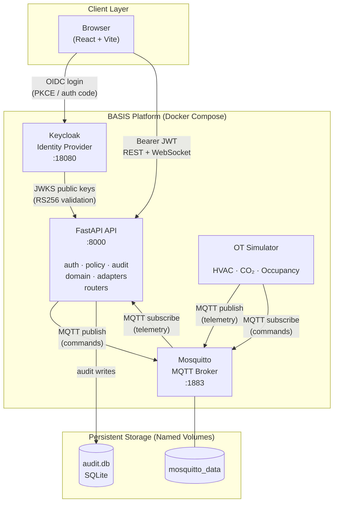
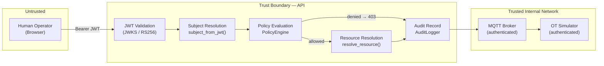
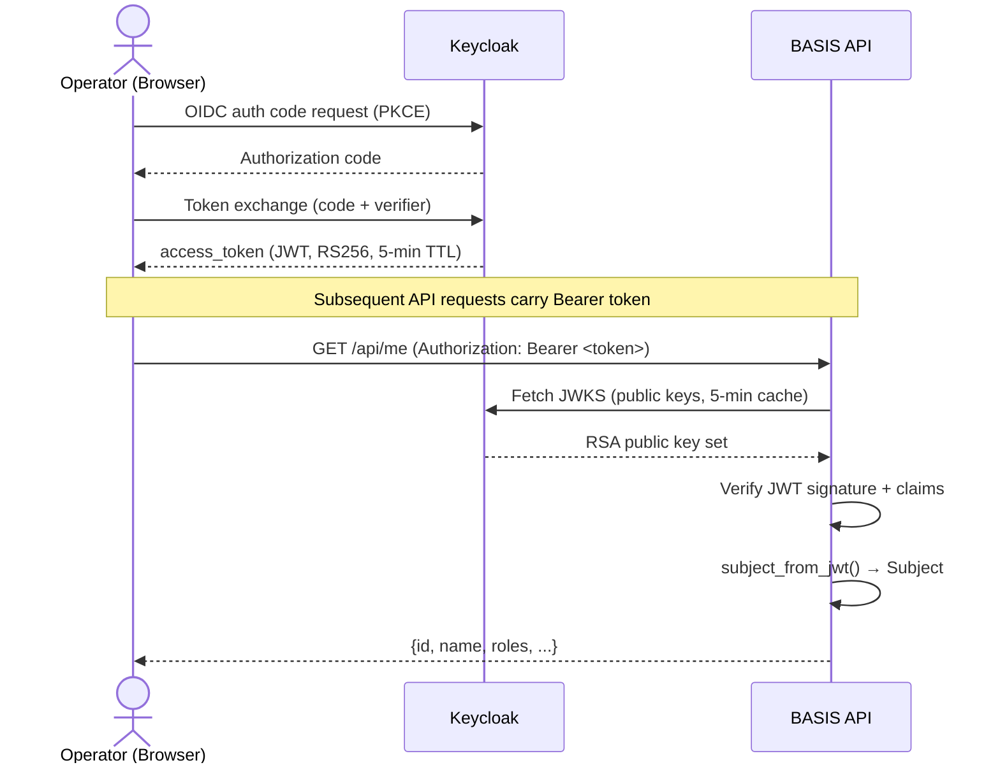
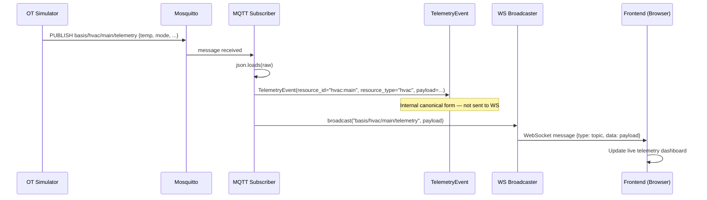
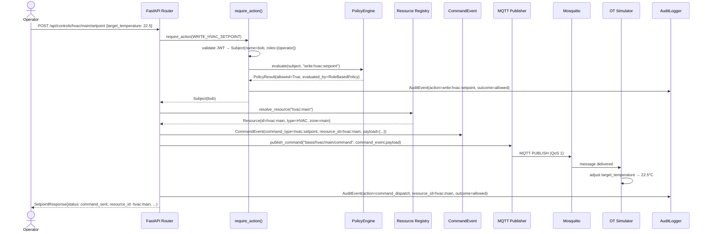
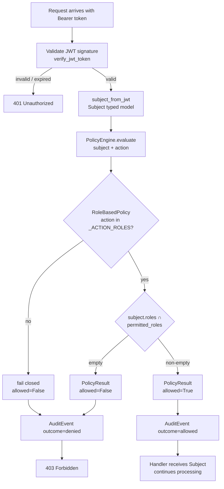
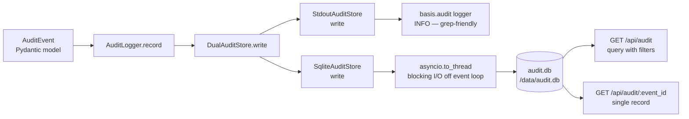

# BASIS Architecture Overview

**Document status:** Current — reflects Stages 5b, 7, 7b, 8  
**Last updated:** 2026-05-12

---

## Table of Contents

- [What BASIS Is](#what-basis-is)
- [The Problem](#the-problem)
- [What BASIS Is and Is Not](#what-basis-is-and-is-not)
- [Architectural Philosophy](#architectural-philosophy)
- [Core Architectural Principles](#core-architectural-principles)
- [Platform Diagram](#platform-diagram)
- [Trust Boundary Diagram](#trust-boundary-diagram)
- [Core Domain Concepts](#core-domain-concepts)
- [Infrastructure Components](#infrastructure-components)
- [Request Lifecycle Walkthroughs](#request-lifecycle-walkthroughs)
  - [Authentication Flow](#authentication-flow)
  - [Telemetry Flow](#telemetry-flow)
  - [Command Dispatch Flow](#command-dispatch-flow)
  - [Authorization Decision Flow](#authorization-decision-flow)
  - [Audit Persistence Flow](#audit-persistence-flow)
- [Developer Walkthroughs](#developer-walkthroughs)
  - [Tracing a Command Through the System](#tracing-a-command-through-the-system)
  - [How Authorization Decisions Occur](#how-authorization-decisions-occur)
  - [How Normalized Events Flow Internally](#how-normalized-events-flow-internally)
  - [How Audit Events Persist](#how-audit-events-persist)
- [Future Documentation Structure](#future-documentation-structure)

---

## What BASIS Is

BASIS is an identity and authorization layer for operational technology (OT) systems. It mediates access to building automation devices — HVAC controllers, environmental sensors, zone management systems — by enforcing policy decisions at the API boundary and recording every authorization outcome to a durable audit trail.

The central function is straightforward: before any command reaches a physical device, BASIS verifies who is asking, determines whether they are permitted to perform the requested action on the targeted resource, records the outcome, and either forwards the command or returns an authorization failure. This happens for every request, every time, without exception.

BASIS is a proof-of-concept demonstrating that the standard identity and authorization patterns applied to IT systems for decades can be applied to OT environments — without cloud dependencies, without complex infrastructure, and without requiring operators to become platform engineers.

---

## The Problem

Building automation and OT systems have historically operated with weak or absent identity controls:

- Authentication is often credential-based with shared passwords, or absent entirely on internal network segments.
- Authorization is typically all-or-nothing: a technician either has access to the entire system or none of it.
- There is no authoritative record of who issued which command and when. The audit trail, if it exists at all, is a log file on a device with no structure and no integrity guarantees.
- MQTT brokers — the message bus layer for many modern OT systems — grant all authenticated clients equal publish and subscribe permissions. There is no per-topic, per-resource, or per-role authorization at the broker level.

The consequence is that a technician with dashboard access can issue override commands. A compromised device credential grants full broker access. There is no way to answer the question "who changed the setpoint in zone 3 at 2 AM on Tuesday?" with any confidence.

BASIS addresses this at the API layer: every control command flows through an identity-verified, policy-evaluated, audit-recorded path before reaching the device.

---

## What BASIS Is and Is Not

Understanding what BASIS is not is as important as understanding what it is.

**BASIS is:**

- An identity-aware authorization layer for OT API access
- A policy enforcement point that mediates between human operators and physical devices
- A normalized audit trail for authorization decisions and command dispatch outcomes
- A local-first platform designed to operate without internet connectivity
- A proof-of-concept for applying standard IAM patterns to OT environments

**BASIS is not:**

- A Building Management System (BMS) — it does not manage devices directly
- A SIEM — it does not aggregate logs from external systems or provide threat detection
- A fleet management platform — it does not provision, update, or monitor device firmware
- An analytics engine — it does not provide time-series analysis, dashboards, or reporting
- A Kubernetes platform — it is a Docker Compose stack by design
- A cloud platform — it has no cloud dependencies on the control path
- An MQTT broker — it uses Mosquitto as a transport component; it does not replace it
- A complete production security product — it is a deliberate, bounded proof-of-concept

---

## Architectural Philosophy

BASIS is shaped by three commitments that appear in every significant design decision:

**1. The authorization layer is the boundary.** OT devices behind BASIS do not authenticate API callers directly. They receive commands through a channel — the MQTT broker — that has been secured at the producer side (the API). The API is the trust enforcement point. This is architecturally similar to how an API gateway mediates access in IT systems: the downstream service trusts the gateway to have authenticated and authorized the request before forwarding it.

**2. Local-first is a hard constraint, not a preference.** Many OT environments are air-gapped. Control systems for buildings, industrial facilities, and critical infrastructure are intentionally isolated from corporate networks and the internet. Every architectural choice in BASIS is evaluated against the question: "does this work in an air-gapped environment?" Cloud identity providers, managed databases, external log aggregation, and container orchestration platforms all fail this test. SQLite, Mosquitto, Keycloak, and Docker Compose pass it.

**3. Operational simplicity is a security property.** Complex infrastructure is hard to secure. A system that requires a Kubernetes cluster, a managed certificate authority, a cloud secrets manager, and three separate databases to operate is a system that will be misconfigured, incompletely patched, and poorly understood by the operators responsible for its security. BASIS is deliberately simple: one compose file, one process, local files for state.

---

## Core Architectural Principles

### Local-First

Every component runs in a single Docker Compose stack with no external network dependencies. After initial image pull, the platform operates indefinitely without internet access. This is not a development convenience — it is the deployment model for air-gapped OT environments.

_See [ADR-0006](../adr/ADR-0006-local-first-architecture.md)_

### Modular Monolith

The API service is a single process with clean internal module boundaries. The domain model, policy engine, audit layer, and protocol adapters are separate modules with an enforced import graph — but they run in the same process. This provides the internal clarity of a well-structured service decomposition without the operational overhead of distributed systems.

_See [ADR-0001](../adr/ADR-0001-modular-monolith-architecture.md)_

### Normalized Domain Models

The core domain concepts — Subject, Resource, Action, Event — are typed Pydantic models defined in `domain/`. Transport formats (MQTT payloads, WebSocket messages, JWT claims) are translated into domain models at the protocol boundary. Everything inside the boundary works with domain models, not wire formats.

_See [ADR-0005](../adr/ADR-0005-subject-resource-event-normalization.md)_

### MQTT as Transport Only

MQTT is the message bus between the API and OT devices. It is treated strictly as a transport layer. The canonical representation of a telemetry observation is a `TelemetryEvent` domain model, not a `(topic, payload)` pair. The canonical representation of a command is a `CommandEvent` domain model, not a raw dict. The adapter layer translates between these representations; nothing else touches wire formats.

_See [ADR-0003](../adr/ADR-0003-mqtt-as-transport-layer.md)_

### Wire Compatibility Preservation

Internal architecture can evolve — new domain models, new policy implementations, new normalization steps — without changing external contracts. The WebSocket wire format, MQTT payload format, and REST API response shapes are stable. Changes to internal representations are separate from changes to external contracts.

_See [ADR-0007](../adr/ADR-0007-wire-compatibility-during-refactors.md)_

### Action-Based Authorization

Endpoints declare what they do (`require_action(WRITE_HVAC_SETPOINT)`), not who may access them. The policy layer maps actions to permitted roles. This decouples the authorization model from the endpoint definition and centralizes role-to-permission mappings in a single file.

_See [ADR-0004](../adr/ADR-0004-action-based-authorization.md)_

### Operational Simplicity

Audit persistence is SQLite — not PostgreSQL, not Elasticsearch. Deployment is `docker compose up`. Configuration is environment variables. Secrets are Docker env vars or `.env` files. No migration framework, no ORM, no container orchestration. Complexity is added only when a second use case requires it.

_See [ADR-0002](../adr/ADR-0002-sqlite-audit-persistence.md), [ADR-0008](../adr/ADR-0008-no-kubernetes-dependency.md)_

---

## Platform Diagram



---

## Trust Boundary Diagram



All requests from human operators cross the trust boundary at JWT validation. Inside the boundary, every request carries a typed `Subject` with verified claims. OT devices (simulator) authenticate directly to the MQTT broker using per-service credentials — they do not interact with the API authentication layer.

---

## Core Domain Concepts

The domain vocabulary of BASIS consists of six concepts. These are defined as typed models in `services/api/domain/` and used throughout the authorization, audit, and event processing paths.

### Subject

A `Subject` is an authenticated identity — the _who_ of any authorization decision.

```
Subject
  id          string     JWT sub claim (stable across sessions)
  name        string     preferred_username
  type        SubjectType  human | device | service | gateway | agent
  roles       list[str]  realm roles at time of request
  email       string?    optional
```

Every JWT arriving at the API is translated into a `Subject` at a single boundary (`subject_from_jwt()`). After that point, nothing in the authorization or audit path touches the raw JWT dict. The `SubjectType` enum anticipates non-human subjects (device identities, service accounts) without requiring them to fit into the human role hierarchy.

### Action

An `Action` is a named description of what a subject intends to do — the _what_ of any authorization decision.

Actions follow the convention `<verb>:<domain>[:<object>]`:

```
read:api:viewer          viewer-tier endpoint access
write:hvac:setpoint      send a setpoint command to an HVAC zone
read:audit:log           query the persisted audit trail
read:resources           enumerate the OT resource registry
```

Actions are stable string constants defined in `policy/actions.py`. They appear verbatim in audit records. Renaming an action constant breaks audit trail continuity — action names are treated as stable identifiers once they ship.

### Resource

A `Resource` is a named OT object that can be targeted by an action — the _what_ of a command dispatch.

```
Resource
  id          string       normalized identifier: "{type}:{name}"  e.g. "hvac:main"
  type        ResourceType hvac | sensor | zone | device | gateway
  name        string       qualifier component: "main", "co2", "occupancy"
  zone        string?      logical zone: "main"
  description string?      human-readable description
```

Resources are defined in a static registry (`domain/resource.py`). `resolve_resource("hvac:main")` looks up a resource by its normalized ID. `list_resources(ResourceType.HVAC)` lists all HVAC resources. Adding a new simulated device means adding one entry to `_REGISTRY`.

The normalized ID format (`"{type}:{name}"`) makes resource identity self-describing in audit records without requiring the reviewer to parse topic strings or endpoint paths.

### Event

Three event types represent the internal canonical forms of things that happen in the system:

**`AuditEvent`** — an authorization decision or command dispatch outcome. Written to the audit log by `require_action()` (for every protected endpoint call) and by the controls router (for command delivery outcomes). Contains the full subject context, action, resource, outcome, and optional detail.

**`TelemetryEvent`** — an inbound telemetry observation from a sensor or device. Constructed in the MQTT subscriber from the raw `(topic, payload)` pair. Carries `resource_id` and `resource_type` resolved from `TOPIC_TO_RESOURCE`, decoupling the internal representation from the MQTT topic structure.

**`CommandEvent`** — an outbound control command. Constructed in the controls router before MQTT publish. Captures the full command context (subject, resource, action, payload) in one typed object.

`domain/events.py` has no project imports — it is the base of the import graph. Every other module may import from it; it imports only from the standard library and Pydantic.

### Policy

The `PolicyEngine` evaluates whether a subject is permitted to perform an action. It uses a chain-of-responsibility pattern: a list of `Policy` implementations is evaluated in order until one returns a result or the chain is exhausted.

```
PolicyEngine
  policies: list[Policy]

  evaluate(subject, action, resource_id?) → PolicyResult
    allowed: bool
    reason:  str
    evaluated_by: str
```

The current implementation is `RoleBasedPolicy`, which maps action names to sets of permitted roles. The policy chain fails closed: an action not registered in any policy produces `allowed=False`. Non-human subjects that are not handled by `RoleBasedPolicy` are passed to the next policy in the chain; if no policy handles them, access is denied.

Adding a new authorization model — attribute-based, zone-scoped, time-windowed — means adding a new `Policy` implementation to the chain. No existing policy, endpoint, or call site changes.

### Audit

The audit subsystem consists of three components:

**`AuditStore` (abstract)** — the persistence interface. `write(event: AuditEvent)` must never raise; implementations swallow failures and log them. The interface decouples call sites from persistence backends.

**`StdoutAuditStore`** — writes structured key=value lines to the `basis.audit` logger. Grep-friendly in `docker compose logs`. Preserved in full.

**`SqliteAuditStore`** — writes to `/data/audit.db`. Indexed on timestamp, subject_id, outcome, action, and resource_id. Supports `query()` with AND-combined filters and `get_by_id()` for single-event lookup.

**`DualAuditStore`** — composite that writes to both. The production configuration.

**`AuditLogger`** — the facade used by all call sites. Accepts any `AuditStore`. Swallows all exceptions. Imported as a module-level singleton: `from audit import audit_logger`.

---

## Infrastructure Components

### Keycloak — Identity Provider

Keycloak issues OIDC tokens and is the authority for user identities and realm roles. The API validates JWTs by fetching the JWKS endpoint (public keys, RS256), caching them for 5 minutes, and verifying the token signature and claims on every request. Keycloak realm configuration is imported from a local file at container startup — no manual console configuration is required after initial setup.

The API has no dependency on Keycloak on the audit or command dispatch path — only on the token validation path. A Keycloak outage prevents new authentications but does not affect in-flight requests carrying valid, unexpired tokens.

### Mosquitto — MQTT Broker

Mosquitto is the internal message bus between the API and the OT simulator. It is configured to require per-service credential authentication (Stage 6). The API subscribes to `basis/#` and publishes to `basis/hvac/{zone}/command`. The simulator subscribes to `basis/hvac/+/command` and publishes to telemetry topics.

Mosquitto is a transport component. It has no knowledge of authorization policy, no per-topic access control beyond broker-level authentication, and no role in the audit trail. It is intentionally kept in that role.

### SQLite — Audit Persistence

The audit database lives at `/data/audit.db` inside the `audit_data` Docker named volume. The schema is initialized at API startup with `CREATE TABLE IF NOT EXISTS`. WAL journal mode is enabled for concurrent read/write access. Writes are executed in a thread pool (`asyncio.to_thread`) to avoid blocking the event loop.

Direct inspection: `docker compose exec api sqlite3 /data/audit.db ".mode column" ".headers on" "SELECT timestamp, subject_name, action, outcome FROM audit_events ORDER BY timestamp DESC LIMIT 10"`

### WebSocket — Telemetry Delivery

The `ws_manager` broadcaster maintains a set of active WebSocket connections. When the MQTT subscriber receives a telemetry message, it broadcasts the raw `(topic, payload)` pair to all connected clients. The frontend subscribes to these messages and updates the live telemetry dashboard.

The WebSocket wire format is stable by design. Internal changes to how telemetry is processed (e.g., `TelemetryEvent` construction in Stage 7b) do not affect what the frontend receives.

---

## Request Lifecycle Walkthroughs

### Authentication Flow



The browser never sends credentials to the API directly. The API never stores tokens. Token validation is stateless: the JWKS cache is the only persistent state in the authentication path.

### Telemetry Flow



The `TelemetryEvent` is constructed and used internally (logging, future routing). The WebSocket broadcast receives the original topic and payload unchanged. The frontend does not receive `TelemetryEvent` — it receives the raw MQTT payload.

### Command Dispatch Flow



### Authorization Decision Flow



Authorization is evaluated on every request. The result — allowed or denied — is recorded to the audit trail before the handler executes (for allowed) or before returning the error (for denied). There is no path through a protected endpoint that does not produce an audit record.

### Audit Persistence Flow



`AuditLogger.record()` never raises. Any exception from either store is caught, logged as an error, and swallowed. Audit failures do not affect the outcome of the request being audited.

---

## Developer Walkthroughs

### Tracing a Command Through the System

Follow a `POST /api/controls/hvac/main/setpoint` request through every layer:

**1. Router entry** (`routers/controls.py`)

```python
@router.post("/hvac/{zone}/setpoint")
async def set_hvac_setpoint(zone, command: SetpointCommand,
                             subject: Subject = Depends(require_action(WRITE_HVAC_SETPOINT))):
```

`require_action()` runs before the handler body. By the time `subject` is available, the JWT has been validated, the policy has been evaluated, and an audit record has been written.

**2. Resource resolution** (`domain/resource.py`)

```python
resource_id = ResourceIdentifier.build(ResourceType.HVAC, zone)  # "hvac:main"
resource    = resolve_resource(resource_id)                       # Resource(...)
```

If `zone` does not match a registered resource, the request fails with 404 before any MQTT publish.

**3. CommandEvent construction** (`domain/events.py`)

```python
command_event = CommandEvent(
    command_type="hvac:setpoint", resource_id=resource.id,
    resource_type=resource.type.value, subject_id=subject.id,
    subject_name=subject.name, action=WRITE_HVAC_SETPOINT,
    payload=mqtt_payload,
)
```

The `CommandEvent` captures the full command context in one typed object. From this point, `command_event.payload` is passed to the publisher — the MQTT wire format is unchanged.

**4. MQTT publish** (`adapters/mqtt/publisher.py`)

```python
await publish_command(topic, command_event.payload)
```

`publish_command` uses `asyncio.to_thread` with `paho.mqtt.publish.single` — fire-and-forget, QoS 1. Raises `RuntimeError` on connection failure.

**5. Dispatch audit record** (`routers/controls.py`)

```python
await audit_logger.record(AuditEvent(
    action="command_dispatch", resource_id=resource.id,
    resource_type=resource.type.value, outcome="allowed",
    detail={"target_temperature": command.target_temperature},
))
```

Two audit records exist for a successful command: one from `require_action()` (action=`write:hvac:setpoint`) and one from the handler (action=`command_dispatch`). The first records the authorization decision; the second records the delivery outcome.

### How Authorization Decisions Occur

Every protected endpoint uses `require_action()` as a FastAPI dependency:

```python
subject: Subject = Depends(require_action(actions.WRITE_HVAC_SETPOINT))
```

`require_action()` is a factory that returns a FastAPI dependency function. That function:

1. Calls `get_current_user()` — extracts and validates the Bearer JWT
2. Calls `subject_from_jwt()` — translates the raw JWT dict into a typed `Subject`
3. Calls `policy_engine.evaluate(subject, action)` — evaluates the `PolicyEngine`
4. Records an `AuditEvent` with the outcome (regardless of whether access was allowed or denied)
5. Raises `HTTPException(403)` if denied, or returns the `Subject` if allowed

The `PolicyEngine` walks its list of `Policy` objects. `RoleBasedPolicy`:

- Returns `None` for non-HUMAN subjects (passes to the next policy)
- Looks up the action in `_ACTION_ROLES`; returns `None` if the action is not registered
- Returns `PolicyResult(allowed=True)` if the subject has a permitted role
- Returns `PolicyResult(allowed=False)` otherwise

If the chain produces no result, the engine fails closed with `allowed=False`.

To understand why a specific request was denied: check the audit log for `outcome=denied` and read the `reason` field. The reason string comes directly from `PolicyResult.reason`.

### How Normalized Events Flow Internally

**Inbound telemetry path:**

```
MQTT message arrives
  → subscriber._handle_message(topic, raw)
  → json.loads(raw) → payload dict
  → TOPIC_TO_RESOURCE.get(topic) → resource_id
  → TelemetryEvent(resource_id, resource_type, source=topic, payload=payload)
    [internal — for logging and future routing]
  → broadcaster.broadcast(topic, payload)
    [WebSocket clients receive raw topic + payload unchanged]
```

The `TelemetryEvent` is constructed and available for internal logic (logging, filtering, future policy routing). It is not forwarded anywhere — the WebSocket broadcast is the original raw payload.

**Outbound command path:**

```
Handler assembles mqtt_payload dict
  → CommandEvent(command_type, resource_id, resource_type, subject_*, action, payload=mqtt_payload)
    [internal — full command context in one typed object]
  → publish_command(topic, command_event.payload)
    [MQTT broker receives original dict unchanged]
```

The `CommandEvent.payload` is the same dict that was previously assembled inline. The `CommandEvent` adds typed metadata around it without reformatting the MQTT payload.

### How Audit Events Persist

`audit_logger.record(event)` is called from two places:

1. `require_action()` — on every protected endpoint call, for both allowed and denied outcomes
2. `routers/controls.py` — after MQTT publish attempt, recording delivery outcome

The call is awaited but never fails the request:

```python
async def record(self, event: AuditEvent) -> None:
    try:
        await self._store.write(event)
    except Exception as exc:
        log.error("Audit write failed (non-fatal) — event_id=%s  error=%s", ...)
```

`DualAuditStore` calls `StdoutAuditStore.write()` first, then `SqliteAuditStore.write()`. Each store has independent error handling. A SQLite write failure does not suppress the stdout log line. A stdout failure does not suppress the SQLite write.

`SqliteAuditStore.write()` runs `_write_sync()` in a thread pool:

```python
async def write(self, event: AuditEvent) -> None:
    try:
        await asyncio.to_thread(self._write_sync, event)
    except Exception as exc:
        log.error("SqliteAuditStore write failed (non-fatal) ...")
```

The SQL is a single `INSERT OR IGNORE` — duplicate `event_id` values are silently dropped, making writes idempotent. This protects against double-writes that could occur during error recovery.

To read audit records directly:

```bash
# Most recent 20 events
docker compose exec api sqlite3 /data/audit.db \
  "SELECT timestamp, subject_name, action, outcome FROM audit_events ORDER BY timestamp DESC LIMIT 20"

# All denied requests
docker compose exec api sqlite3 /data/audit.db \
  "SELECT timestamp, subject_name, action, reason FROM audit_events WHERE outcome='denied'"

# Command history for a specific resource
docker compose exec api sqlite3 /data/audit.db \
  "SELECT timestamp, subject_name, detail FROM audit_events WHERE resource_id='hvac:main' AND action='command_dispatch'"
```

Or via the API (admin token required):

```bash
# List recent events
curl -H "Authorization: Bearer $TOKEN" http://localhost:8000/api/audit

# Filter by outcome
curl -H "Authorization: Bearer $TOKEN" "http://localhost:8000/api/audit?outcome=denied"

# Filter by resource
curl -H "Authorization: Bearer $TOKEN" "http://localhost:8000/api/audit?resource_id=hvac:main&limit=50"
```

---

## Future Documentation Structure

As BASIS evolves, the documentation structure should follow the same principles as the code: add when a second use case requires it, not speculatively.

**Near-term additions that would be warranted:**

`docs/architecture/import-graph.md` — A precise description of the module dependency rules with the rationale for each constraint. Useful for contributors making changes that touch multiple modules.

`docs/architecture/policy-model.md` — A detailed walkthrough of the `PolicyEngine` chain-of-responsibility design and how to implement a new `Policy`. Needed once zone-scoped or attribute-based policies are introduced.

`docs/architecture/resource-registry.md` — Documentation for the static resource registry: how to add a resource, naming conventions, zone semantics. Needed once the registry grows beyond a handful of entries or moves to configuration-driven initialization.

**Contributor onboarding:**

A `CONTRIBUTING.md` at the repository root covering: development environment setup, the test pattern, the import graph constraints, how to add a new resource, and how to add a new action to the policy model.

**Tutorial direction:**

A worked example showing the complete path for adding a new OT device type — from defining a `ResourceType` enum variant, to registering resources, to defining actions, to writing policy rules, to verifying the audit trail. This is the most practical demonstration of the architecture's extensibility.

---

_This document reflects the state of the platform after Stages 5b, 7, 7b, and 8. For the reasoning behind specific architectural choices, see the [ADRs](../adr/README.md). For the high-level problem statement and setup instructions, see the [README](../../README.md)._
